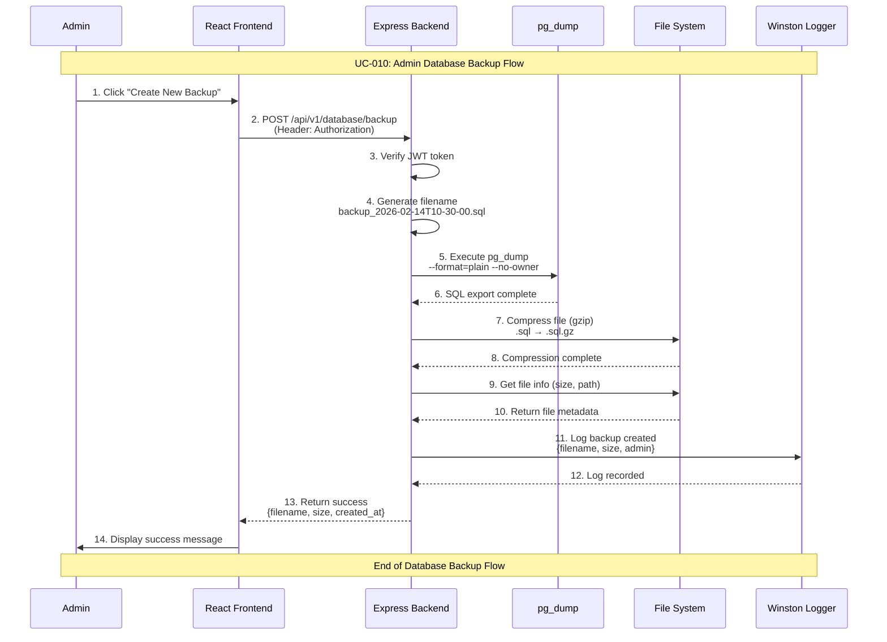

# Admin Database Backup Use Case

## Use Case: UC-010 - Admin Create Database Backup
**Version:** 1.0  
**Date:** February 14, 2026  
**Author:** System Architect  

---

## Use Case Description
This use case describes the process of creating a database backup in the admin dashboard. The admin can manually trigger a full database backup, which exports all tables, data, and sequences using pg_dump, compresses the output file, and stores it in the backups directory. The system also supports automated daily backups via a cron job scheduler.

---

## Actors
- **Primary Actor:** Admin
- **Secondary Actor:** System (Backend Service, File System, Cron Scheduler)
- **External Systems:** PostgreSQL Database, pg_dump utility, File System (backups/ directory)

---

## Preconditions
1. Admin is authenticated and has valid JWT token
2. Admin has access to admin dashboard
3. Database connection is active
4. pg_dump utility is available on the server
5. backups/ directory exists and is writable
6. Sufficient disk space is available

---

## Postconditions

### Success Postconditions
1. Backup file is created in backups/ directory
2. Backup file is compressed (gzip format)
3. Backup filename includes timestamp for identification
4. Backup creation is logged in system logs
5. Admin receives confirmation with file details (name, size)

### Failure Postconditions
1. No backup file is created
2. Error message is displayed to admin
3. Failure is logged with technical details
4. Existing backups remain unaffected

---

## Main Success Scenario

### Step 1: Initiate Backup
1. Admin navigates to Database Management section
2. Admin clicks "Create New Backup" button
3. System validates admin permissions

### Step 2: Generate Backup
1. System generates filename with timestamp: `backup_2026-02-14T10-30-00.sql`
2. System executes pg_dump command to export entire database
3. pg_dump exports all tables, data, indexes, and sequences
4. System monitors export progress

### Step 3: Compress Backup
1. System compresses the .sql file using gzip
2. Compressed file: `backup_2026-02-14T10-30-00.sql.gz`
3. Original .sql file is removed after compression
4. System calculates compressed file size

### Step 4: Confirm Success
1. System retrieves file metadata (name, size, date)
2. System logs successful backup creation
3. Admin receives success response with backup details
4. New backup appears in backups list

---

## Alternative Flows

### AF-1: Automated Daily Backup
**Trigger:** Cron job triggers at 2:00 AM daily
1. Scheduler initiates backup process automatically
2. System follows Steps 2-4 without admin interaction
3. System checks for old backups (>30 days) and deletes them
4. Backup result is logged (success or failure)
5. No admin confirmation needed

### AF-2: Insufficient Disk Space
**Trigger:** Not enough space for backup file
1. System detects insufficient disk space before or during backup
2. System returns error: "Insufficient disk space for backup"
3. Admin is advised to delete old backups or free space
4. Backup process is aborted cleanly

### AF-3: pg_dump Failure
**Trigger:** pg_dump utility fails
1. pg_dump command returns error (permission denied, config error)
2. System catches error and removes partial backup file
3. Admin receives error: "Backup failed: pg_dump error"
4. Error details are logged for debugging

---

## Exception Flows

### EF-1: Database Connection Lost During Backup
**Trigger:** Database connection drops during pg_dump
1. pg_dump fails with connection error
2. Partial backup file is removed
3. Error is logged with details
4. Admin can retry when connection is restored

### EF-2: File System Error
**Trigger:** Cannot write to backups/ directory
1. System cannot create backup file
2. Error: "Cannot write to backup directory"
3. System administrator must fix permissions
4. Error is logged

---

## Sequence Diagram



---

## Data Flow

### Input Data
```
POST /api/v1/database/backup
Authorization: Bearer <jwt_token>
```

### Output Data (Success)
```json
{
  "success": true,
  "message": "Backup created successfully",
  "data": {
    "filename": "backup_2026-02-14T10-30-00.sql.gz",
    "size": "2.5 MB",
    "created_at": "2026-02-14T10:30:00Z",
    "path": "backups/backup_2026-02-14T10-30-00.sql.gz"
  }
}
```

### Output Data (Failure)
```json
{
  "success": false,
  "error": "Backup creation failed",
  "message": "pg_dump process failed with exit code 1"
}
```

---

## Technical Requirements

### API Endpoint
```javascript
POST /api/v1/database/backup
Authorization: Bearer <jwt_token>
```

### pg_dump Command
```bash
pg_dump --host=$DB_HOST --port=$DB_PORT --username=$DB_USER \
  --dbname=$DB_NAME --format=plain --no-owner --no-privileges \
  --file=backups/backup_TIMESTAMP.sql
```

### Cron Job Configuration
```javascript
// Daily backup at 2:00 AM
const cron = require('node-cron');
cron.schedule('0 2 * * *', async () => {
  // Create backup
  // Delete old backups (>30 days)
  // Log results
});
```

### Backup Retention Policy
- Keep backups for 30 days
- Auto-delete backups older than 30 days during scheduled backup
- Manual backups follow same retention policy
- Minimum 1 backup always maintained

---

## Business Rules

### BR-1: Admin Only Access
- Only authenticated admins can create manual backups
- Automated backups run without admin interaction
- All backup operations are logged

### BR-2: Backup Naming Convention
- Format: `backup_YYYY-MM-DDTHH-mm-ss.sql.gz`
- Timestamp ensures unique filenames
- Compressed with gzip for space efficiency

### BR-3: Backup Completeness
- Full database backup (all tables, data, sequences)
- No partial backups
- Backup must complete successfully or be removed

### BR-4: Storage Management
- Backups stored in `backups/` directory
- Directory excluded from git (.gitignore)
- Auto-cleanup removes backups older than 30 days

---

## Success Criteria

1. ✅ Admin can create manual database backups
2. ✅ Automated daily backups run at 2:00 AM
3. ✅ Backups are compressed and properly named
4. ✅ Old backups are automatically cleaned up
5. ✅ All backup operations are logged

---

## Testing Scenarios

### Test Case 1: Manual Backup Creation
**Input:** Click "Create New Backup"  
**Expected:** Compressed backup file created  
**Verification:** File exists in backups/ directory  

### Test Case 2: Automated Daily Backup
**Input:** Cron job triggers at 2:00 AM  
**Expected:** Backup created, old backups cleaned  
**Verification:** New file in backups/, old files removed  

### Test Case 3: Insufficient Disk Space
**Input:** Disk nearly full  
**Expected:** Error message about disk space  
**Verification:** No partial files left  

---

## Related Use Cases
- **UC-001:** Admin Authentication
- **UC-011:** Admin Database Restore
- **UC-012:** Admin Database Health Check
- **UC-013:** Admin Database Statistics

---

## Dependencies
- PostgreSQL pg_dump utility
- Node.js child_process for command execution
- node-cron for scheduled backups
- File system access (fs module)
- gzip compression (zlib module)
- Winston logging service

---

*This use case document follows the system architecture described in the mindset document and implements Flow 7 (Admin Create Database Backup) as specified in the detailed flow diagrams.*
