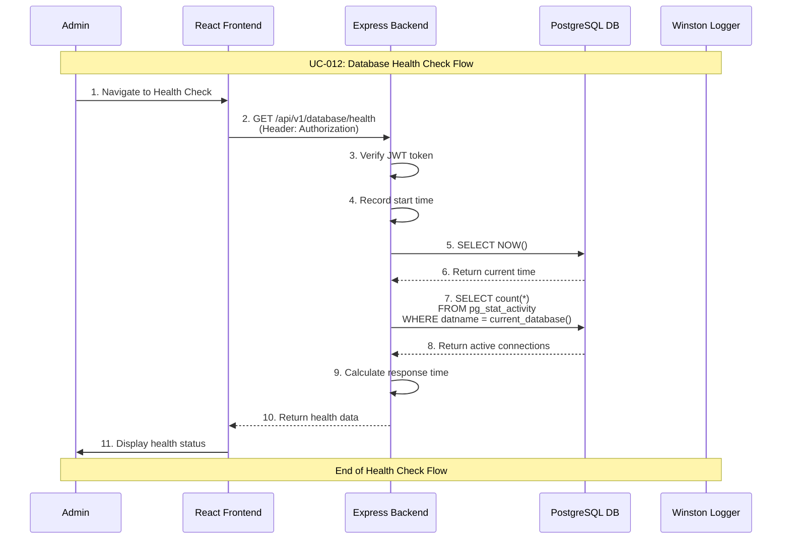

# Admin Database Health Check Use Case

## Use Case: UC-012 - Admin Database Health Check
**Version:** 1.0  
**Date:** February 14, 2026  
**Author:** System Architect  

---

## Use Case Description
This use case describes the process of checking the health status of the database. The admin can view real-time database connectivity status, response time, active connections, and basic system information. This helps the admin monitor system health and quickly identify database issues.

---

## Actors
- **Primary Actor:** Admin
- **Secondary Actor:** System (Backend Service, Database)
- **External Systems:** PostgreSQL Database

---

## Preconditions
1. Admin is authenticated and has valid JWT token
2. Admin has access to admin dashboard
3. Admin has navigated to Database Management section

---

## Postconditions

### Success Postconditions
1. Admin sees current database health status
2. Connection status, response time, and active connections are displayed
3. Health check is logged for monitoring

### Failure Postconditions
1. Admin sees database is unhealthy/unreachable
2. Error details are displayed for troubleshooting
3. Failed health check is logged

---

## Main Success Scenario

### Step 1: Navigate to Health Check
1. Admin navigates to Database Management section
2. Admin clicks "Health Check" or views health dashboard
3. System initiates health check

### Step 2: Execute Health Check
1. System tests database connectivity with `SELECT NOW()`
2. System measures response time (round-trip latency)
3. System queries active connections from `pg_stat_activity`
4. System retrieves database name and version info

### Step 3: Display Health Status
1. System renders health status interface:
   - Status indicator: 🟢 Healthy or 🔴 Unhealthy
   - Database name
   - Current server time
   - Active connections count
   - Response time in milliseconds
2. Admin sees clear health status at a glance

---

## Alternative Flows

### AF-1: Database Unreachable
**Trigger:** Database connection fails
1. System attempts `SELECT NOW()` but connection fails
2. System displays: 🔴 Database Status: Unhealthy
3. Error details shown (connection refused, timeout, etc.)
4. Admin is advised to check database server
5. "Retry" button available

### AF-2: Slow Response Time
**Trigger:** Response time exceeds threshold (>500ms)
1. System detects high response time
2. Status shown as: 🟡 Warning (Slow Response)
3. Response time highlighted in yellow/orange
4. Admin is informed of potential performance issues

---

## Sequence Diagram



---

## Data Flow

### Input Data
```
GET /api/v1/database/health
Authorization: Bearer <jwt_token>
```

### Output Data (Healthy)
```json
{
  "success": true,
  "data": {
    "status": "healthy",
    "database": "request_management",
    "current_time": "2026-02-14T10:30:00Z",
    "active_connections": 5,
    "response_time_ms": 12,
    "version": "PostgreSQL 15.4"
  }
}
```

### Output Data (Unhealthy)
```json
{
  "success": false,
  "data": {
    "status": "unhealthy",
    "error": "Connection refused",
    "response_time_ms": null,
    "checked_at": "2026-02-14T10:30:00Z"
  }
}
```

---

## Technical Requirements

### API Endpoint
```javascript
GET /api/v1/database/health
Authorization: Bearer <jwt_token>
```

### Database Queries
```sql
-- Test connectivity and get server time
SELECT NOW() as current_time;

-- Get active connections count
SELECT COUNT(*) as active_connections
FROM pg_stat_activity
WHERE datname = current_database();

-- Get database version
SELECT version();
```

---

## Business Rules

### BR-1: Non-Destructive Operation
- Health check is read-only, no data modifications
- Safe to run frequently without performance impact
- Does not affect other database operations

### BR-2: Response Time Thresholds
- < 100ms: 🟢 Healthy
- 100-500ms: 🟡 Warning
- > 500ms: 🔴 Slow/Unhealthy

---

## Success Criteria

1. ✅ Admin can check database health status
2. ✅ Response time is accurately measured
3. ✅ Active connections count is displayed
4. ✅ Clear visual indicators for health status
5. ✅ Proper error handling when database is unreachable

---

## Testing Scenarios

### Test Case 1: Healthy Database
**Input:** Database is running normally  
**Expected:** 🟢 Healthy status with response time < 100ms  

### Test Case 2: Database Unreachable
**Input:** Database server is stopped  
**Expected:** 🔴 Unhealthy status with error details  

### Test Case 3: Slow Response
**Input:** Database under heavy load  
**Expected:** 🟡 Warning with high response time  

---

## UI/UX Requirements

### Health Status Display
```
┌────────────────────────────────────┐
│ 🟢 Database Status: Healthy        │
├────────────────────────────────────┤
│ Database: request_management       │
│ Current Time: 2026-02-14 10:30:00  │
│ Active Connections: 5              │
│ Response Time: 12ms                │
│ Version: PostgreSQL 15.4           │
├────────────────────────────────────┤
│         [🔄 Refresh]              │
└────────────────────────────────────┘
```

---

## Related Use Cases
- **UC-001:** Admin Authentication
- **UC-010:** Admin Database Backup
- **UC-011:** Admin Database Restore
- **UC-013:** Admin Database Statistics

---

## Dependencies
- Express.js framework with JWT middleware
- PostgreSQL database
- Winston logging service

---

*This use case document follows the system architecture described in the mindset document and implements Flow 10 (Database Health Check) as specified in the detailed flow diagrams.*
