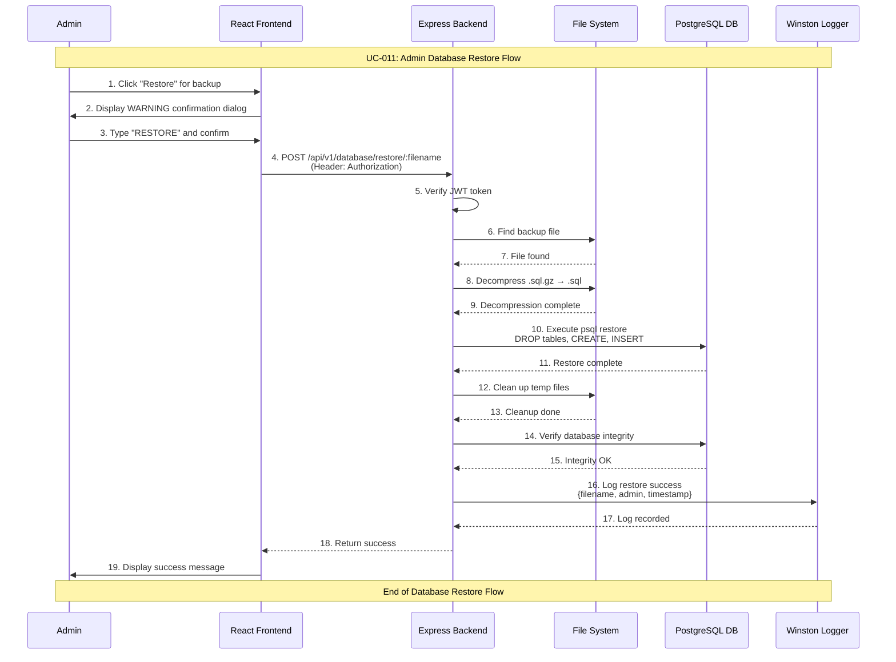

# Admin Database Restore Use Case

## Use Case: UC-011 - Admin Restore Database from Backup
**Version:** 1.0  
**Date:** February 14, 2026  
**Author:** System Architect  

---

## Use Case Description
This use case describes the process of restoring a database from a previously created backup file. The admin selects a backup from the available list, confirms the destructive action, and the system restores the database to the state captured in the backup. This is a critical operation that replaces all current data with the backup data.

---

## Actors
- **Primary Actor:** Admin
- **Secondary Actor:** System (Backend Service, File System)
- **External Systems:** PostgreSQL Database, pg_restore/psql utility, File System (backups/ directory)

---

## Preconditions
1. Admin is authenticated and has valid JWT token
2. Admin has access to admin dashboard
3. At least one backup file exists in backups/ directory
4. Database connection is active
5. pg_restore/psql utility is available on the server
6. Backup file is not corrupted

---

## Postconditions

### Success Postconditions
1. Database is restored to the state in the backup file
2. All current data is replaced with backup data
3. Database schema, data, and sequences are restored
4. Restore operation is logged in system logs
5. Admin receives confirmation with restore details

### Failure Postconditions
1. Database remains in current state (no changes)
2. Error message is displayed to admin
3. Failure is logged with technical details
4. Backup file remains available for retry

---

## Main Success Scenario

### Step 1: View Available Backups
1. Admin navigates to Database Management section
2. System fetches list of backup files from backups/ directory
3. Admin sees list with filename, size, and date
4. Admin identifies the backup to restore

### Step 2: Select Backup for Restore
1. Admin clicks "Restore" button for selected backup
2. System displays strong confirmation dialog:
   - "⚠️ WARNING: This will REPLACE all current data"
   - Backup file details (name, date, size)
   - "Are you absolutely sure? This action cannot be undone."
   - Confirmation input: "Type RESTORE to confirm"
3. Admin reads and understands the warning

### Step 3: Confirm Restore
1. Admin types "RESTORE" in confirmation input
2. Admin clicks "Confirm Restore" button
3. System validates confirmation input

### Step 4: Execute Restore
1. System decompresses backup file if .gz format
2. System executes database restore command:
   - Drop existing tables and data
   - Recreate tables from backup
   - Import all data
   - Restore sequences and indexes
3. System monitors restore progress

### Step 5: Post-Restore Cleanup
1. System removes temporary decompressed files
2. System verifies database integrity after restore
3. System tests basic database connectivity

### Step 6: Confirm Success
1. System logs successful restore with details
2. Admin receives success message: "Database restored successfully"
3. Admin can verify data by checking dashboard
4. All application features should work with restored data

---

## Alternative Flows

### AF-1: Backup File Corrupted
**Trigger:** Backup file is corrupted or incomplete
1. System attempts to decompress or read backup file
2. File integrity check fails
3. System returns error: "Backup file is corrupted or incomplete"
4. Database remains unchanged
5. Admin should try a different backup file

### AF-2: Backup File Not Found
**Trigger:** Selected backup file no longer exists
1. Admin selects backup but file has been deleted
2. System returns error: "Backup file not found"
3. Admin refreshes backup list
4. Admin selects different backup

### AF-3: Restore Fails Mid-Process
**Trigger:** Database error during restore operation
1. psql/pg_restore encounters error during import
2. System attempts to log the failure
3. System returns error with details
4. Database may be in inconsistent state
5. Admin should restore from another backup immediately
6. System logs critical error

### AF-4: Admin Cancels Confirmation
**Trigger:** Admin clicks "Cancel" in confirmation dialog
1. System closes confirmation dialog
2. No changes are made to database
3. Admin returns to backups list
4. No action is logged

---

## Exception Flows

### EF-1: Database Connection Lost During Restore
**Trigger:** Database connection drops mid-restore
1. Restore process is interrupted
2. Database may be in partial state
3. System logs critical error
4. Admin must manually verify database state
5. Another restore attempt may be needed

### EF-2: Insufficient Permissions
**Trigger:** Database user lacks permissions for restore
1. psql command fails with permission error
2. System returns error: "Insufficient database permissions"
3. System administrator must fix permissions
4. Database remains unchanged

---

## Sequence Diagram



---

## Data Flow

### Input Data
```
POST /api/v1/database/restore/backup_2026-02-14T10-30-00.sql.gz
Authorization: Bearer <jwt_token>
```

### Output Data (Success)
```json
{
  "success": true,
  "message": "Database restored successfully",
  "data": {
    "filename": "backup_2026-02-14T10-30-00.sql.gz",
    "restored_at": "2026-02-14T15:30:00Z",
    "tables_restored": 4,
    "status": "complete"
  }
}
```

### Output Data (Failure)
```json
{
  "success": false,
  "error": "Restore failed",
  "message": "psql process failed: relation already exists",
  "details": {
    "filename": "backup_2026-02-14T10-30-00.sql.gz",
    "step": "import_data",
    "error_code": "42P07"
  }
}
```

---

## Technical Requirements

### API Endpoint
```javascript
POST /api/v1/database/restore/:filename
Authorization: Bearer <jwt_token>
```

### Restore Command
```bash
# Decompress
gunzip -k backups/backup_TIMESTAMP.sql.gz

# Drop and recreate database
psql --host=$DB_HOST --port=$DB_PORT --username=$DB_USER \
  --dbname=$DB_NAME --file=backups/backup_TIMESTAMP.sql
```

---

## Business Rules

### BR-1: Destructive Operation
- Restore replaces ALL current data with backup data
- This action CANNOT be undone
- Admin must explicitly confirm with "RESTORE" input
- Strong warning must be displayed before proceeding

### BR-2: Pre-Restore Backup
- System should recommend creating a backup before restore
- Optional: Auto-create backup before restore begins
- This provides a fallback if restore causes issues

### BR-3: Admin Only Access
- Only authenticated admins can perform restore
- All restore operations are logged with admin identity
- Failed attempts are also logged

### BR-4: Post-Restore Verification
- System verifies database connectivity after restore
- Basic table existence check
- Application should function normally after restore

---

## Success Criteria

1. ✅ Admin can restore database from any available backup
2. ✅ Strong confirmation prevents accidental restore
3. ✅ Database is fully restored with all data
4. ✅ Temporary files are cleaned up after restore
5. ✅ All restore operations are logged

---

## Testing Scenarios

### Test Case 1: Successful Restore
**Input:** Valid backup file selected, confirmed  
**Expected:** Database restored, all data matches backup  
**Verification:** Query tables to verify data state  

### Test Case 2: Cancel Restore
**Input:** Admin clicks "Cancel" in confirmation  
**Expected:** No changes to database  
**Verification:** Current data unchanged  

### Test Case 3: Corrupted Backup File
**Input:** Backup file with corruption  
**Expected:** Error message, database unchanged  
**Verification:** Current data preserved  

### Test Case 4: File Not Found
**Input:** Backup file deleted before restore  
**Expected:** Error: "Backup file not found"  
**Verification:** Backup list refreshed  

---

## Related Use Cases
- **UC-001:** Admin Authentication
- **UC-010:** Admin Database Backup
- **UC-012:** Admin Database Health Check
- **UC-013:** Admin Database Statistics

---

## Dependencies
- PostgreSQL psql utility
- Node.js child_process for command execution
- File system access (fs module)
- gzip decompression (zlib module)
- Winston logging service

---

*This use case document follows the system architecture described in the mindset document and implements Flow 9 (Admin Restore Database) as specified in the detailed flow diagrams.*
