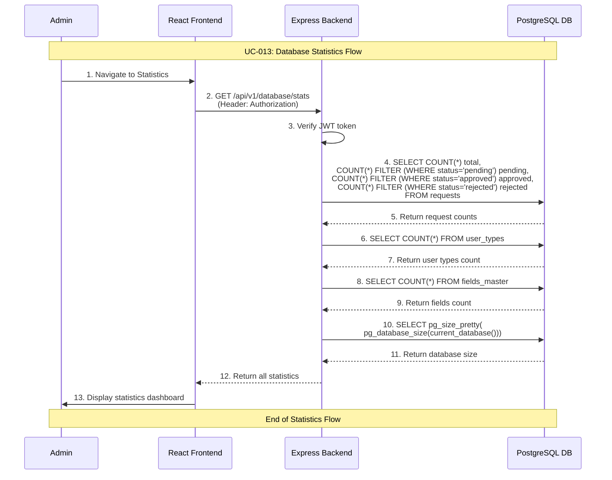

# Admin Database Statistics Use Case

## Use Case: UC-013 - Admin View Database Statistics
**Version:** 1.0  
**Date:** February 14, 2026  
**Author:** System Architect  

---

## Use Case Description
This use case describes the process of viewing comprehensive database statistics in the admin dashboard. The admin can see detailed counts for requests (total, pending, approved, rejected), user types, fields master entries, and database size information. This provides a quick overview of the system state and helps with capacity planning.

---

## Actors
- **Primary Actor:** Admin
- **Secondary Actor:** System (Backend Service, Database)
- **External Systems:** PostgreSQL Database

---

## Preconditions
1. Admin is authenticated and has valid JWT token
2. Admin has access to admin dashboard
3. Database connection is active

---

## Postconditions

### Success Postconditions
1. Admin sees comprehensive database statistics
2. Request counts are broken down by status
3. User types and fields counts are displayed
4. Database size information is shown
5. Statistics are current and accurate

### Failure Postconditions
1. Error message is displayed if statistics cannot be loaded
2. Admin sees error with retry option
3. Failure is logged

---

## Main Success Scenario

### Step 1: Navigate to Statistics
1. Admin navigates to Database Management section
2. Admin clicks "Statistics" or views statistics dashboard
3. System initiates statistics queries

### Step 2: Fetch Statistics Data
1. System queries request counts by status
2. System queries user types count
3. System queries fields master count
4. System queries database size
5. All queries run efficiently using COUNT and aggregate functions

### Step 3: Display Statistics
1. System renders statistics dashboard with:
   - Total requests count
   - Pending requests count and percentage
   - Approved requests count and percentage
   - Rejected requests count and percentage
   - Total user types count
   - Total fields master count
   - Database size
2. Admin sees clear, visual statistics overview

---

## Alternative Flows

### AF-1: Empty Database
**Trigger:** Database has no data
1. System detects all counts are zero
2. Statistics display with zero values
3. Admin sees empty state with helpful message
4. "Get started" guidance is shown

### AF-2: Large Dataset
**Trigger:** Many requests in system (>10,000)
1. Statistics queries may take longer
2. System uses optimized aggregate queries
3. Loading indicator shown during fetch
4. Results cached briefly for performance

---

## Sequence Diagram



---

## Data Flow

### Input Data
```
GET /api/v1/database/stats
Authorization: Bearer <jwt_token>
```

### Output Data (Success)
```json
{
  "success": true,
  "data": {
    "database_name": "request_management",
    "database_size": "25.3 MB",
    "requests": {
      "total": 150,
      "pending": 25,
      "approved": 100,
      "rejected": 25,
      "pending_percentage": 16.67,
      "approved_percentage": 66.67,
      "rejected_percentage": 16.67
    },
    "user_types": {
      "total": 5,
      "active": 4,
      "inactive": 1
    },
    "fields_master": {
      "total": 15
    },
    "generated_at": "2026-02-14T10:30:00Z"
  }
}
```

### Output Data (Failure)
```json
{
  "success": false,
  "error": "Failed to retrieve statistics",
  "message": "Database query timeout"
}
```

---

## Technical Requirements

### API Endpoint
```javascript
GET /api/v1/database/stats
Authorization: Bearer <jwt_token>
```

### Database Queries
```sql
-- Request statistics
SELECT 
  COUNT(*) as total,
  COUNT(*) FILTER (WHERE status = 'pending') as pending,
  COUNT(*) FILTER (WHERE status = 'approved') as approved,
  COUNT(*) FILTER (WHERE status = 'rejected') as rejected
FROM requests;

-- User types count
SELECT 
  COUNT(*) as total,
  COUNT(*) FILTER (WHERE is_active = true) as active,
  COUNT(*) FILTER (WHERE is_active = false) as inactive
FROM user_types;

-- Fields master count
SELECT COUNT(*) as total FROM fields_master;

-- Database size
SELECT pg_size_pretty(pg_database_size(current_database())) as size;
```

---

## Business Rules

### BR-1: Non-Destructive Operation
- Statistics queries are read-only
- No data modifications occur
- Safe to query frequently

### BR-2: Real-Time Data
- Statistics reflect current database state
- No caching (always fresh data)
- Percentages calculated dynamically

### BR-3: Admin Only Access
- Only authenticated admins can view statistics
- JWT token required
- Sensitive system information protected

---

## Success Criteria

1. ✅ Admin can view comprehensive database statistics
2. ✅ Request counts are accurate and broken down by status
3. ✅ Percentages are correctly calculated
4. ✅ User types and fields counts displayed
5. ✅ Database size information shown
6. ✅ Statistics load within 2 seconds

---

## Testing Scenarios

### Test Case 1: View Statistics with Data
**Input:** Database has 150 requests, 5 user types  
**Expected:** All counts and percentages displayed correctly  
**Verification:** Counts match manual database queries  

### Test Case 2: Empty Database Statistics
**Input:** No data in any table  
**Expected:** All counts show 0, percentages show 0%  
**Verification:** Zero values displayed correctly  

### Test Case 3: Unauthorized Access
**Input:** No JWT token  
**Expected:** 401 Unauthorized  
**Verification:** No statistics returned  

---

## UI/UX Requirements

### Statistics Dashboard Layout
```
┌──────────────────────────────────────────────────────┐
│ 📊 Database Statistics                               │
├──────────────────────────────────────────────────────┤
│ Database: request_management                         │
│ Total Size: 25.3 MB                                  │
│                                                      │
│ 📋 Requests:                                         │
│   • Total: 150                                       │
│   • Pending: 25  (17%)  ⏳                           │
│   • Approved: 100 (67%) ✅                           │
│   • Rejected: 25  (17%) ❌                           │
│                                                      │
│ 👥 User Types: 5 (4 active, 1 inactive)             │
│ 📝 Fields Master: 15                                 │
│                                                      │
│ Generated at: 2026-02-14 10:30:00                    │
│                                                      │
│              [🔄 Refresh Statistics]                 │
└──────────────────────────────────────────────────────┘
```

---

## Related Use Cases
- **UC-001:** Admin Authentication
- **UC-008:** Admin View Requests (detailed request views)
- **UC-010:** Admin Database Backup
- **UC-012:** Admin Database Health Check

---

## Dependencies
- Express.js framework with JWT middleware
- PostgreSQL database with aggregate functions
- React frontend for dashboard display
- Winston logging service

---

*This use case document follows the system architecture described in the mindset document and implements Flow 11 (Database Statistics) as specified in the detailed flow diagrams.*
