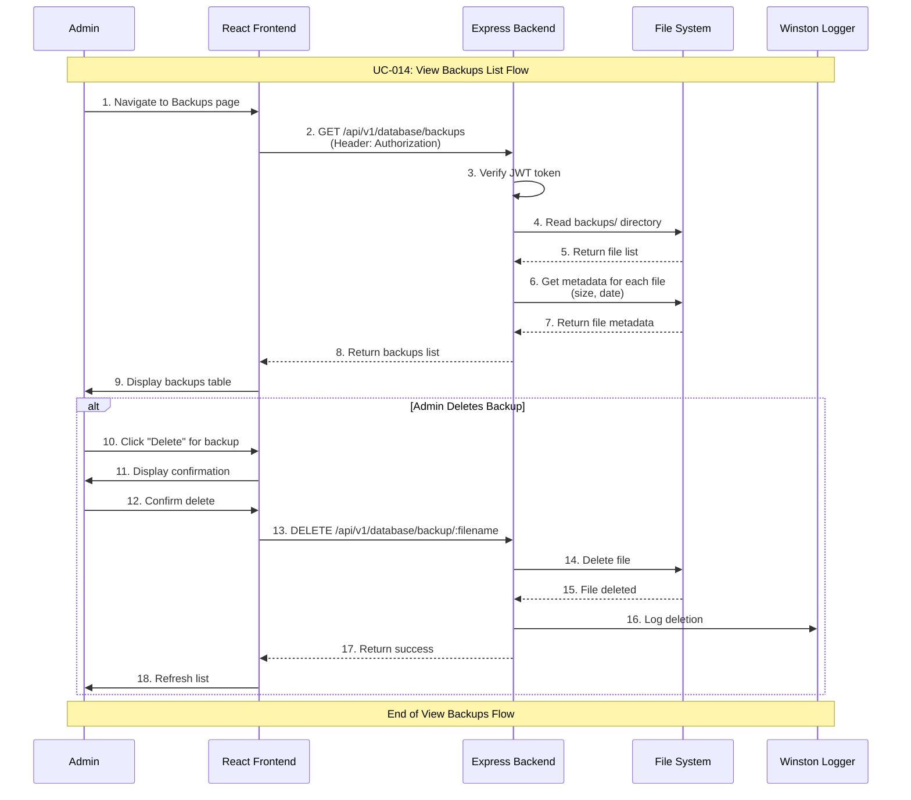

# Admin View Backups List Use Case

## Use Case: UC-014 - Admin View and Manage Backups List
**Version:** 1.0  
**Date:** February 14, 2026  
**Author:** System Architect  

---

## Use Case Description
This use case describes the process of viewing the list of all available database backups and managing them (viewing details, deleting old backups). The admin can see all backup files with their names, sizes, and creation dates, and can perform management actions such as triggering a restore or deleting unneeded backups.

---

## Actors
- **Primary Actor:** Admin
- **Secondary Actor:** System (Backend Service, File System)
- **External Systems:** File System (backups/ directory)

---

## Preconditions
1. Admin is authenticated and has valid JWT token
2. Admin has access to admin dashboard
3. backups/ directory exists on the server

---

## Postconditions

### Success Postconditions
1. Admin sees complete list of backup files
2. Each backup displays filename, size, and creation date
3. Management actions are available for each backup
4. Admin can navigate to restore or delete actions

### Failure Postconditions
1. Error message displayed if backups directory is inaccessible
2. Admin sees error with retry option

---

## Main Success Scenario

### Step 1: Navigate to Backups List
1. Admin navigates to Database Management section
2. Admin clicks "Backups" tab or link
3. System reads backups/ directory

### Step 2: Fetch Backups Data
1. System scans backups/ directory for .sql.gz files
2. System retrieves file metadata for each backup:
   - Filename
   - File size (formatted: KB, MB)
   - Creation date (from filename timestamp)
   - Last modified date
3. System sorts backups by date (newest first)

### Step 3: Display Backups List
1. System renders backups list with:
   - Total backups count
   - Table with filename, size, date, and actions
   - "Create New Backup" button
   - Action buttons per backup: Restore (↓), Delete (🗑)
2. Admin sees organized backup management interface

### Step 4: Manage Backups
1. Admin can:
   - Click "Restore" → Triggers UC-011 (Database Restore)
   - Click "Delete" → Confirms and deletes backup file
   - Click "Create New Backup" → Triggers UC-010 (Database Backup)
2. List refreshes after any action

---

## Alternative Flows

### AF-1: No Backups Exist
**Trigger:** backups/ directory is empty
1. System displays empty state: "No backups available"
2. "Create First Backup" button prominently displayed
3. Admin can create new backup immediately

### AF-2: Delete Backup
**Trigger:** Admin clicks delete button for a backup
1. System displays confirmation: "Delete backup_2026-02-14T10-30-00.sql.gz?"
2. Admin confirms deletion
3. System sends DELETE request to `/api/v1/database/backup/:filename`
4. Backend deletes file from backups/ directory
5. List refreshes with backup removed
6. Deletion is logged

### AF-3: Delete Last Backup Warning
**Trigger:** Admin tries to delete the only remaining backup
1. System warns: "This is the last backup. Are you sure?"
2. Admin can proceed or cancel
3. If proceeding, backup is deleted normally

---

## Sequence Diagram



---

## Data Flow

### Input Data
```
GET /api/v1/database/backups
Authorization: Bearer <jwt_token>
```

### Output Data (Success)
```json
{
  "success": true,
  "data": [
    {
      "filename": "backup_2026-02-14T10-30-00.sql.gz",
      "size": "2.5 MB",
      "size_bytes": 2621440,
      "created_at": "2026-02-14T10:30:00Z"
    },
    {
      "filename": "backup_2026-02-13T02-00-00.sql.gz",
      "size": "2.3 MB",
      "size_bytes": 2411724,
      "created_at": "2026-02-13T02:00:00Z"
    },
    {
      "filename": "backup_2026-02-12T02-00-00.sql.gz",
      "size": "2.2 MB",
      "size_bytes": 2306867,
      "created_at": "2026-02-12T02:00:00Z"
    }
  ],
  "total": 3
}
```

### Delete Backup - Input
```
DELETE /api/v1/database/backup/backup_2026-02-12T02-00-00.sql.gz
Authorization: Bearer <jwt_token>
```

### Delete Backup - Output
```json
{
  "success": true,
  "message": "Backup deleted successfully",
  "data": {
    "filename": "backup_2026-02-12T02-00-00.sql.gz",
    "deleted_at": "2026-02-14T15:00:00Z"
  }
}
```

---

## Technical Requirements

### API Endpoints
```javascript
// List all backups
GET /api/v1/database/backups
Authorization: Bearer <jwt_token>

// Delete specific backup
DELETE /api/v1/database/backup/:filename
Authorization: Bearer <jwt_token>
```

---

## Business Rules

### BR-1: Admin Only Access
- Only authenticated admins can view and manage backups
- All operations require valid JWT token

### BR-2: File Safety
- Only .sql.gz files in backups/ directory are listed
- Path traversal attacks are prevented (filename validation)
- Files outside backups/ directory cannot be accessed or deleted

### BR-3: Sorting
- Backups are sorted by creation date (newest first)
- Most recent backup is always at the top

---

## Success Criteria

1. ✅ Admin can view list of all available backups
2. ✅ Backup details (name, size, date) are displayed
3. ✅ Admin can delete specific backups
4. ✅ Delete confirmation prevents accidental deletion
5. ✅ List refreshes after actions

---

## UI/UX Requirements

### Backups List Layout
```
┌─────────────────────────────────────────────────────────────────┐
│ النسخ الاحتياطية - Database Backups (3 total)                    │
├─────────────────────────────────────────────────────────────────┤
│ File Name                    │ Size   │ Date       │ Action     │
├──────────────────────────────┼────────┼────────────┼────────────┤
│ backup_2026-02-14T10-30.gz   │ 2.5 MB │ 2026-02-14 │ [↓] [🗑]  │
│ backup_2026-02-13T02-00.gz   │ 2.3 MB │ 2026-02-13 │ [↓] [🗑]  │
│ backup_2026-02-12T02-00.gz   │ 2.2 MB │ 2026-02-12 │ [↓] [🗑]  │
│                                                                 │
│              [+ Create New Backup]                              │
└─────────────────────────────────────────────────────────────────┘
```

---

## Related Use Cases
- **UC-001:** Admin Authentication
- **UC-010:** Admin Database Backup (creates backups)
- **UC-011:** Admin Database Restore (restores from backup)
- **UC-012:** Admin Database Health Check
- **UC-013:** Admin Database Statistics

---

## Dependencies
- Express.js framework with JWT middleware
- File system access (fs module)
- Winston logging service

---

*This use case document follows the system architecture described in the mindset document and implements Flow 8 (Admin View Backups List) as specified in the detailed flow diagrams.*
