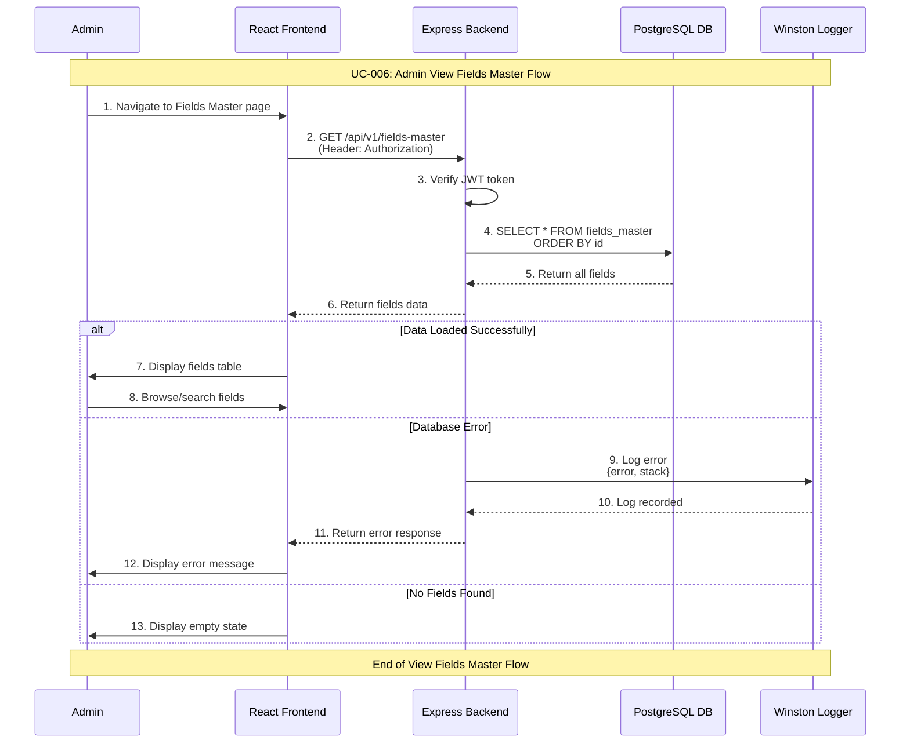

# Admin View Fields Master Use Case

## Use Case: UC-006 - Admin View Fields Master
**Version:** 1.0  
**Date:** February 14, 2026  
**Author:** System Architect  

---

## Use Case Description
This use case describes the process of viewing all available master fields in the system. The admin can see a comprehensive list of all predefined fields from the fields_master table that can be assigned to user types when creating or editing them. This is the foundational data that drives the dynamic form system.

---

## Actors
- **Primary Actor:** Admin
- **Secondary Actor:** System (Backend Service, Database)
- **External Systems:** PostgreSQL Database, fields_master table

---

## Preconditions
1. Admin is authenticated and has valid JWT token
2. Admin has access to admin dashboard
3. Database connection is active
4. fields_master table exists and contains field definitions

---

## Postconditions

### Success Postconditions
1. Admin sees complete list of all master fields
2. Each field displays name, label, type, and options
3. Admin understands available fields for user type configuration
4. Page load is logged for audit

### Failure Postconditions
1. Error message is displayed if data cannot be loaded
2. Admin sees fallback interface with retry options
3. Failed attempts are logged for debugging

---

## Main Success Scenario

### Step 1: Navigate to Fields Master
1. Admin clicks on "Fields Master" in admin dashboard navigation
2. System validates admin JWT token
3. Admin is directed to fields master management page
4. Loading indicator is displayed while data is fetched

### Step 2: Fetch Fields Data
1. System sends GET request to `/api/v1/fields-master`
2. Backend verifies JWT token authorization
3. System retrieves all fields from fields_master table
4. System prepares data for display with proper formatting

### Step 3: Display Fields List
1. System renders fields master interface with:
   - Header with total fields count
   - Fields table with comprehensive information:
     - Field Name (internal identifier)
     - Field Label (display name in Arabic/English)
     - Field Type (text, email, tel, number, dropdown, textarea)
     - Field Options (for dropdown fields - JSON array)
     - Created Date
   - Search/filter functionality
2. Admin sees clear, organized view of all available fields

### Step 4: View Field Details
1. Admin can click on any field to see full details
2. System displays field configuration including:
   - All field properties
   - User types currently using this field
   - Usage count across user types
3. Admin understands how each field is being used

### Step 5: Field Usage Information
1. System shows which user types use each field
2. Admin can see required/optional status per user type
3. Admin can navigate to related user type from field view

---

## Alternative Flows

### AF-1: Empty Fields Master Table
**Trigger:** No fields exist in fields_master table
1. System detects empty fields_master table
2. System displays empty state message:
   - "No fields available in the system"
   - "Fields must be seeded into the database"
   - Technical guidance for database administrator
3. Admin cannot create user types without available fields

### AF-2: Search and Filter
**Trigger:** Admin uses search functionality
1. Admin enters search terms in search bar
2. System filters results by field name, label, or type
3. Results update dynamically as admin types
4. Admin can filter by field type (text, email, dropdown, etc.)

### AF-3: Large Number of Fields
**Trigger:** System has many fields (>50)
1. System implements pagination for performance
2. Fields are displayed with page navigation
3. Search works across all pages
4. Sorting options available (name, type, date)

---

## Exception Flows

### EF-1: Database Connection Error
**Trigger:** Database is unavailable
1. System cannot retrieve fields data
2. System displays error: "Unable to load fields"
3. "Retry" button is available
4. Error is logged with stack trace

### EF-2: Authentication Token Expired
**Trigger:** Admin's JWT token expires
1. System detects expired token
2. Admin is redirected to login page
3. After re-authentication, admin returns to fields page

---

## Sequence Diagram



---

## Data Flow

### Input Data
```
GET /api/v1/fields-master
Authorization: Bearer <jwt_token>
```

### Output Data (Success)
```json
{
  "success": true,
  "message": "Fields retrieved successfully",
  "data": [
    {
      "id": 1,
      "field_name": "name",
      "field_label": "الاسم الكامل",
      "field_type": "text",
      "field_options": null,
      "created_at": "2026-01-01T10:00:00Z",
      "updated_at": "2026-01-01T10:00:00Z"
    },
    {
      "id": 2,
      "field_name": "email",
      "field_label": "البريد الإلكتروني",
      "field_type": "email",
      "field_options": null,
      "created_at": "2026-01-01T10:00:00Z",
      "updated_at": "2026-01-01T10:00:00Z"
    },
    {
      "id": 7,
      "field_name": "course",
      "field_label": "التخصص",
      "field_type": "dropdown",
      "field_options": ["CS", "Engineering", "Medicine"],
      "created_at": "2026-01-01T10:00:00Z",
      "updated_at": "2026-01-01T10:00:00Z"
    }
  ],
  "total": 8
}
```

### Output Data (Failure)
```json
{
  "success": false,
  "error": "Failed to retrieve fields",
  "message": "Database connection error"
}
```

---

## Technical Requirements

### API Endpoint
```javascript
GET /api/v1/fields-master
Authorization: Bearer <jwt_token>
Content-Type: application/json
```

### Database Operations
```sql
-- Get all master fields
SELECT * FROM fields_master ORDER BY id;

-- Get fields with usage count
SELECT fm.*, 
       COUNT(utf.id) as usage_count
FROM fields_master fm
LEFT JOIN user_type_fields utf ON fm.id = utf.field_id
GROUP BY fm.id
ORDER BY fm.id;
```

---

## Business Rules

### BR-1: Field Immutability
- Fields in fields_master are predefined and seeded
- Admins view fields but do not create/edit/delete them from the UI
- Field modifications require database-level access
- This ensures system stability and consistency

### BR-2: Field Types
- Supported field types: text, email, tel, number, dropdown, textarea
- Field type determines HTML input rendering
- Dropdown fields must have valid field_options JSON array
- Field types cannot be changed after creation

### BR-3: Access Control
- Only authenticated admins can view fields master
- Fields data is not exposed to regular users directly
- JWT token is required for all fields master endpoints

---

## Success Criteria

### Functional Success Criteria
1. ✅ Admin can view all available master fields
2. ✅ Fields display name, label, type, and options correctly
3. ✅ Search and filter functionality works properly
4. ✅ Field usage information is accurate
5. ✅ Page loads within acceptable time

### Non-Functional Success Criteria
1. ✅ Page loads within 2 seconds
2. ✅ Responsive design for different screen sizes
3. ✅ Proper error handling and user feedback
4. ✅ All operations are logged for audit

---

## Testing Scenarios

### Test Case 1: Successful Fields Load
**Input:** Valid JWT token, populated fields_master table  
**Expected:** All fields displayed in organized table  
**Verification:** Field count matches database records  

### Test Case 2: Empty Fields Table
**Input:** Valid JWT token, empty fields_master table  
**Expected:** Empty state message displayed  
**Verification:** "No fields available" message shown  

### Test Case 3: Unauthorized Access
**Input:** No JWT token or invalid token  
**Expected:** 401 Unauthorized response  
**Verification:** Admin redirected to login page  

### Test Case 4: Search Functionality
**Input:** Search term "email"  
**Expected:** Only email-related fields shown  
**Verification:** Results filtered correctly  

---

## UI/UX Requirements

### Fields Master Layout
```
┌──────────────────────────────────────────────────────────────────┐
│ Fields Master - Available Fields (8 total)                       │
├──────────────────────────────────────────────────────────────────┤
│ Search: [____________________]  Filter: [All Types ▼]           │
├──────────────────────────────────────────────────────────────────┤
│ # │ Field Name      │ Label           │ Type     │ Options      │
├───┼─────────────────┼─────────────────┼──────────┼──────────────┤
│ 1 │ name            │ الاسم الكامل    │ text     │ -            │
│ 2 │ email           │ البريد الإلكتروني│ email    │ -            │
│ 3 │ phone           │ رقم الهاتف      │ tel      │ -            │
│ 4 │ student_id      │ الرقم الجامعي   │ text     │ -            │
│ 5 │ license_number  │ رقم الرخصة      │ text     │ -            │
│ 6 │ company         │ الشركة          │ text     │ -            │
│ 7 │ course          │ التخصص          │ dropdown │ [CS, Eng...] │
│ 8 │ experience      │ سنوات الخبرة    │ number   │ -            │
└──────────────────────────────────────────────────────────────────┘
```

---

## Related Use Cases
- **UC-001:** Admin Authentication
- **UC-002:** Admin Create User Type (uses fields master data)
- **UC-003:** Admin Edit User Type (uses fields master data)
- **UC-007:** User Create Request (dynamic fields from master)

---

## Dependencies
- Express.js framework with JWT middleware
- PostgreSQL database with fields_master table
- React frontend for display
- Winston logging service

---

*This use case document follows the system architecture described in the mindset document and implements the fields master viewing flow as specified in the API endpoints and database schema.*
