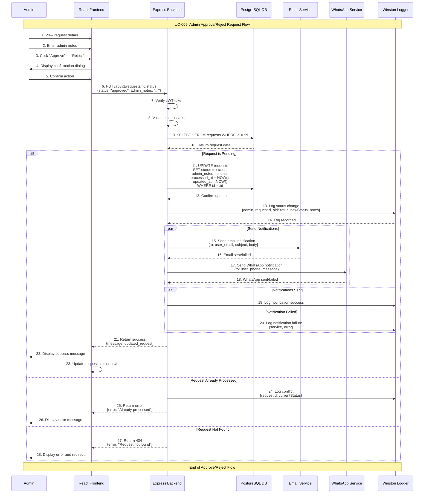

# Admin Approve/Reject Request Use Case

## Use Case: UC-009 - Admin Approve or Reject Request
**Version:** 1.0  
**Date:** February 14, 2026  
**Author:** System Architect  

---

## Use Case Description
This use case describes the process of an admin approving or rejecting a user request. The admin reviews the request details, optionally adds admin notes, and changes the request status to either "approved" or "rejected". Upon status change, the system updates the database, logs the action, and sends a notification to the user via email and/or WhatsApp.

---

## Actors
- **Primary Actor:** Admin
- **Secondary Actor:** System (Backend Service, Database, Notification Service)
- **External Systems:** PostgreSQL Database, Email Service (Gmail SMTP), WhatsApp Service, requests table

---

## Preconditions
1. Admin is authenticated and has valid JWT token
2. Admin has access to admin dashboard
3. Request exists in database with "pending" status
4. Database connection is active
5. Admin has viewed request details (UC-008)
6. Notification services are configured (email/WhatsApp)

---

## Postconditions

### Success Postconditions (Approve)
1. Request status is updated to "approved" in requests table
2. Admin notes are saved with the request
3. processed_at timestamp is recorded
4. User receives approval notification via email/WhatsApp
5. Status change is logged in system logs
6. Request is no longer in "pending" list

### Success Postconditions (Reject)
1. Request status is updated to "rejected" in requests table
2. Admin notes (rejection reason) are saved with the request
3. processed_at timestamp is recorded
4. User receives rejection notification with reason via email/WhatsApp
5. Status change is logged in system logs
6. Request is no longer in "pending" list

### Failure Postconditions
1. Request status remains "pending"
2. No notification is sent
3. Error message is displayed to admin
4. Failed attempt is logged for debugging

---

## Main Success Scenario

### Step 1: View Request Details
1. Admin is viewing request details (from UC-008)
2. Admin sees all submitted data fields
3. Admin sees current status: "pending"
4. Admin sees action buttons: "Approve" and "Reject"
5. Admin sees admin notes text area

### Step 2: Review Request Data
1. Admin reviews all submitted form data:
   - User type and associated fields
   - Name, email, phone, and other specific fields
   - Submission date and time
2. Admin determines appropriate action (approve or reject)

### Step 3: Add Admin Notes (Optional)
1. Admin types notes in the admin notes text area
2. Notes can include:
   - Approval message (e.g., "مرحباً بك، تم قبول طلبك")
   - Rejection reason (e.g., "بيانات ناقصة، يرجى إعادة التقديم")
   - Internal notes for record-keeping
3. Notes are optional for approval, recommended for rejection

### Step 4: Submit Decision
1. Admin clicks "Approve" or "Reject" button
2. System displays confirmation dialog:
   - For Approve: "Are you sure you want to approve this request?"
   - For Reject: "Are you sure you want to reject this request?"
3. Admin confirms the action

### Step 5: Process Status Change
1. System sends PUT request to `/api/v1/requests/:id/status`
2. Backend validates:
   - Request exists and has "pending" status
   - Admin has valid JWT token
   - Status value is valid ("approved" or "rejected")
3. Backend updates request in database:
   - Set status to new value
   - Save admin_notes
   - Set processed_at to current timestamp
   - Update updated_at timestamp

### Step 6: Send Notification
1. System extracts user email from request JSONB data
2. System prepares notification message based on status:
   - **Approval email:** "تم قبول طلبك" with admin notes
   - **Rejection email:** "تم رفض طلبك" with rejection reason
3. System attempts to send email notification via Gmail SMTP
4. System attempts to send WhatsApp notification (if phone available)
5. Notification status is logged (success or failure)

### Step 7: Confirm Success
1. Backend returns success response
2. Frontend displays confirmation: "تم تحديث حالة الطلب" (Request status updated)
3. Request status badge updates in UI
4. Admin is optionally redirected to next pending request or requests list
5. Status change is logged with full details

---

## Alternative Flows

### AF-1: Request Already Processed
**Trigger:** Another admin already processed this request
1. Admin clicks approve/reject but request is no longer pending
2. Backend detects request status is not "pending"
3. System returns error: "Request has already been processed"
4. Admin sees updated status of the request
5. Admin returns to requests list with refreshed data

### AF-2: Email Notification Failure
**Trigger:** Email service fails to send notification
1. Request status is successfully updated in database
2. Email sending fails (SMTP error, invalid email, etc.)
3. System logs email failure with error details
4. Admin is notified: "Status updated but email notification failed"
5. Admin can manually notify user or retry notification
6. Request status remains updated (notification failure doesn't rollback)

### AF-3: WhatsApp Notification Failure
**Trigger:** WhatsApp service fails to send notification
1. Request status is successfully updated in database
2. WhatsApp sending fails (service unavailable, number blocked)
3. System logs WhatsApp failure with error details
4. Email notification may still succeed independently
5. Status update is not affected by WhatsApp failure

### AF-4: Rejection Without Notes
**Trigger:** Admin rejects request without providing reason
1. Admin clicks "Reject" without entering admin notes
2. System displays warning: "It is recommended to provide a rejection reason"
3. Admin can:
   - Add rejection reason and proceed
   - Proceed without notes (allowed but not recommended)
4. If proceeding without notes, notification is sent without specific reason

### AF-5: Bulk Processing (Future Enhancement)
**Trigger:** Admin wants to process multiple requests at once
1. Admin selects multiple pending requests using checkboxes
2. Admin chooses "Approve Selected" or "Reject Selected"
3. System processes each request individually
4. Results summary shows success/failure for each request
5. Notifications are sent for each processed request

---

## Exception Flows

### EF-1: Request Not Found
**Trigger:** Request was deleted between page load and action
1. Admin attempts to process request that no longer exists
2. Backend returns 404: "Request not found"
3. Admin is returned to requests list
4. List is refreshed with current data

### EF-2: Database Transaction Failure
**Trigger:** Database error during status update
1. System attempts to update request status
2. Database transaction fails
3. System returns error: "Failed to update request status"
4. Request remains in "pending" status
5. Admin can retry the action

### EF-3: Authentication Token Expired
**Trigger:** Admin's JWT token expires during processing
1. System detects expired token on API call
2. Status update is not performed
3. Admin is redirected to login page
4. After re-authentication, admin can retry the action

### EF-4: Both Notification Services Fail
**Trigger:** Email and WhatsApp both fail
1. Request status is successfully updated
2. Both notification attempts fail
3. System logs all failures
4. Admin sees warning: "Status updated but all notifications failed"
5. Admin should manually contact the user
6. Failed notifications are queued for retry (if implemented)

---

## Sequence Diagram



---

## Data Flow

### Input Data
```json
PUT /api/v1/requests/1/status
Authorization: Bearer <jwt_token>
Content-Type: application/json

{
  "status": "approved",
  "admin_notes": "مرحباً بك، تم قبول طلبك للتسجيل"
}
```

### Processing Data
- Request existence and status validation
- Status transition validation (only "pending" → "approved"/"rejected")
- Admin notes storage
- Timestamp management
- Notification preparation and delivery
- Audit trail logging

### Output Data (Success)
```json
{
  "success": true,
  "message": "Request status updated successfully",
  "data": {
    "request_id": 1,
    "old_status": "pending",
    "new_status": "approved",
    "admin_notes": "مرحباً بك، تم قبول طلبك للتسجيل",
    "processed_at": "2026-02-14T14:30:00Z",
    "notification": {
      "email": "sent",
      "whatsapp": "sent"
    }
  }
}
```

### Output Data (Failure)
```json
{
  "success": false,
  "error": "Request has already been processed",
  "details": {
    "request_id": 1,
    "current_status": "approved",
    "processed_at": "2026-02-14T12:00:00Z"
  }
}
```

---

## Notification Templates

### Approval Email Template
```
Subject: تم قبول طلبك - Request Approved

مرحباً {name}،

يسرنا إبلاغك بأنه تم قبول طلبك للتسجيل كـ {user_type}.

تفاصيل الطلب:
- رقم الطلب: #{request_id}
- نوع الطلب: {user_type}
- تاريخ التقديم: {created_at}
- تاريخ القبول: {processed_at}

ملاحظات المدير: {admin_notes}

شكراً لك.
```

### Rejection Email Template
```
Subject: تحديث حالة طلبك - Request Update

مرحباً {name}،

نأسف لإبلاغك بأنه تم رفض طلبك.

تفاصيل الطلب:
- رقم الطلب: #{request_id}
- نوع الطلب: {user_type}
- تاريخ التقديم: {created_at}

سبب الرفض: {admin_notes}

يمكنك التقديم مرة أخرى بعد مراجعة الملاحظات أعلاه.

شكراً لك.
```

### WhatsApp Message Template
```
مرحباً {name}،
تم {status_text} طلبك رقم #{request_id}.
{admin_notes_if_any}
```

---

## Technical Requirements

### API Endpoint
```javascript
PUT /api/v1/requests/:id/status
Authorization: Bearer <jwt_token>
Content-Type: application/json

Body:
{
  "status": "approved" | "rejected",
  "admin_notes": "string (optional)"
}
```

### Database Operations
```sql
-- Get current request status
SELECT id, status, data, user_type_id 
FROM requests 
WHERE id = $1;

-- Update request status
UPDATE requests 
SET status = $1, 
    admin_notes = $2, 
    processed_at = CURRENT_TIMESTAMP, 
    updated_at = CURRENT_TIMESTAMP 
WHERE id = $3 AND status = 'pending'
RETURNING *;

-- Get user type name for notification
SELECT ut.type_name 
FROM user_types ut 
WHERE ut.id = $1;
```

### Validation Rules
```javascript
const statusUpdateSchema = {
  status: Joi.string()
    .valid('approved', 'rejected')
    .required(),
  admin_notes: Joi.string()
    .max(1000)
    .allow('', null)
    .optional()
};
```

### Email Service Configuration
```javascript
// Gmail SMTP configuration
const emailConfig = {
  service: 'gmail',
  auth: {
    user: process.env.EMAIL_USER,      // Gmail address
    pass: process.env.EMAIL_APP_PASS   // Gmail app password
  }
};
// Note: Limited to ~100 emails/day with free Gmail
```

---

## Business Rules

### BR-1: Status Transitions
- Only "pending" requests can be approved or rejected
- Status transitions: pending → approved OR pending → rejected
- No reverse transitions (approved → pending is not allowed)
- No direct transition from approved to rejected or vice versa

### BR-2: Admin Notes
- Admin notes are optional for approval
- Admin notes are strongly recommended for rejection (to explain reason)
- Notes are visible to the admin in dashboard
- Notes are included in user notifications
- Maximum 1000 characters

### BR-3: Notification Policy
- Notifications are sent on every status change
- Email notification is primary channel
- WhatsApp notification is secondary (best-effort)
- Notification failure does NOT rollback status change
- Failed notifications are logged for manual follow-up

### BR-4: Audit Trail
- Every status change must be logged with:
  - Admin email who performed the action
  - Request ID and old/new status
  - Admin notes
  - Timestamp and IP address
- Notification delivery status is also logged

### BR-5: Concurrency
- Only one admin can process a request at a time
- If request is already processed, second admin gets error
- Database ensures atomic status update
- No locking mechanism - database constraint handles conflicts

---

## Success Criteria

### Functional Success Criteria
1. ✅ Admin can approve pending requests
2. ✅ Admin can reject pending requests with notes
3. ✅ Request status is updated in database correctly
4. ✅ User receives email notification on status change
5. ✅ User receives WhatsApp notification on status change
6. ✅ Already processed requests cannot be re-processed
7. ✅ All status changes are logged

### Non-Functional Success Criteria
1. ✅ Status update completes within 3 seconds
2. ✅ Email notification sent within 10 seconds
3. ✅ Notification failure doesn't affect status update
4. ✅ System handles concurrent processing gracefully
5. ✅ Proper error messages for all failure scenarios

---

## Testing Scenarios

### Test Case 1: Approve Pending Request
**Input:** Accept request #1 with notes "مرحباً بك"  
**Expected:** Status changed to "approved", notification sent  
**Verification:** Database updated, email received by user  

### Test Case 2: Reject Pending Request
**Input:** Reject request #3 with notes "بيانات ناقصة"  
**Expected:** Status changed to "rejected", notification sent with reason  
**Verification:** Database updated, rejection email received  

### Test Case 3: Process Already Processed Request
**Input:** Try to approve request that is already "approved"  
**Expected:** Error: "Request has already been processed"  
**Verification:** No database changes, no notifications  

### Test Case 4: Email Notification Failure
**Input:** Approve request but email service is down  
**Expected:** Status updated, warning shown about email failure  
**Verification:** Status changed in DB, email failure logged  

### Test Case 5: Approve Without Notes
**Input:** Approve request without admin notes  
**Expected:** Status updated, generic approval notification sent  
**Verification:** admin_notes is null in database  

### Test Case 6: Reject Without Notes
**Input:** Reject request without providing reason  
**Expected:** Warning shown, admin can proceed or add notes  
**Verification:** Status updated if admin proceeds  

---

## UI/UX Requirements

### Action Interface
```
┌─────────────────────────────────────────────────────────────┐
│ Request #1 - Type: student                                  │
│ Status: ⏳ Pending                                           │
├─────────────────────────────────────────────────────────────┤
│ Name: أحمد محمد                                             │
│ Email: ahmed@mail.com                                       │
│ Phone: 0501234567                                           │
│ Student ID: STU001                                          │
│ Course: Computer Science                                    │
├─────────────────────────────────────────────────────────────┤
│ Admin Notes:                                                │
│ [مرحباً، تم قبول طلبك________________________________]      │
│                                                             │
│     [✓ Approve]     [✗ Reject]                              │
└─────────────────────────────────────────────────────────────┘
```

### Confirmation Dialog
```
┌────────────────────────────────────────────┐
│ ⚠️ Confirm Action                          │
├────────────────────────────────────────────┤
│ Are you sure you want to APPROVE           │
│ request #1 from أحمد محمد?                  │
│                                            │
│ This action cannot be undone.              │
│                                            │
│     [Cancel]     [Confirm Approve]         │
└────────────────────────────────────────────┘
```

### Notification Sent Confirmation
```
┌────────────────────────────────────────────┐
│ ✅ Request #1 Approved Successfully        │
├────────────────────────────────────────────┤
│ ✅ Email sent to ahmed@mail.com            │
│ ✅ WhatsApp sent to 0501234567             │
│                                            │
│ [View Next Pending]  [Back to Requests]    │
└────────────────────────────────────────────┘
```

---

## Related Use Cases
- **UC-001:** Admin Authentication (required for access)
- **UC-007:** User Create Request (creates the requests)
- **UC-008:** Admin View Requests (admin views before processing)
- **UC-005:** Admin View User Types (user type context)

---

## Dependencies
- Express.js framework with JWT middleware
- PostgreSQL database
- Nodemailer for email notifications (Gmail SMTP)
- WhatsApp service (unofficial scraping solution)
- Joi validation library
- Winston logging service

---

*This use case document follows the system architecture described in the mindset document and implements Flow 5 (Admin Approve/Reject Request) as specified in the detailed flow diagrams and business requirements.*
