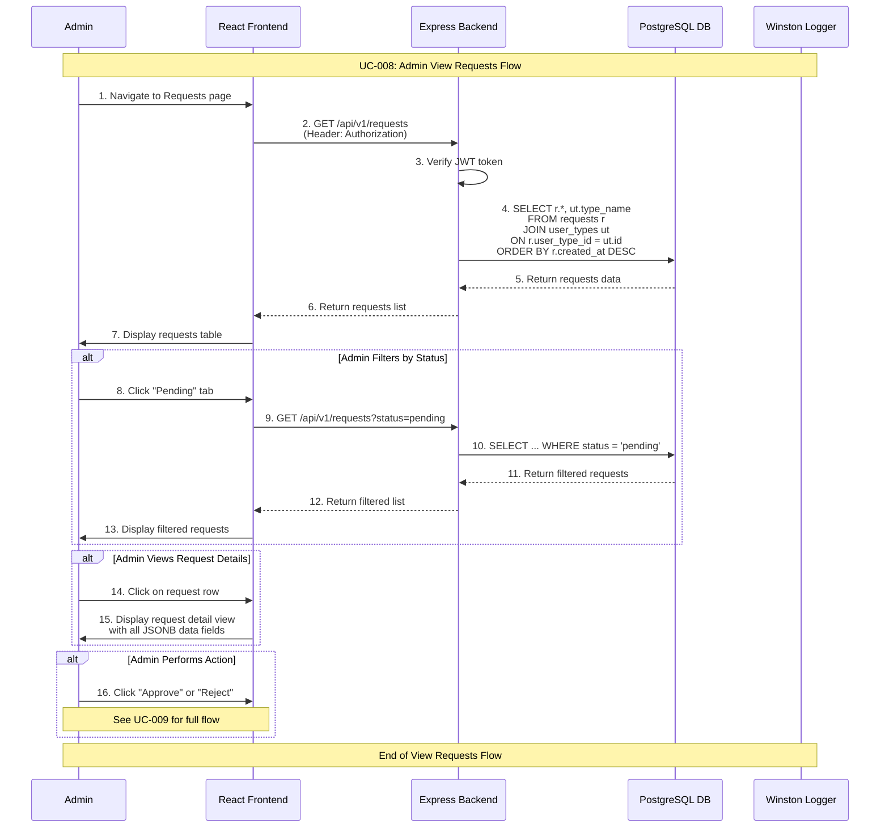

# Admin View Requests Use Case

## Use Case: UC-008 - Admin View and Manage Requests
**Version:** 1.0  
**Date:** February 14, 2026  
**Author:** System Architect  

---

## Use Case Description
This use case describes the process of viewing and managing all submitted requests in the admin dashboard. The admin can see a comprehensive list of all requests, filter by status (pending, approved, rejected), view request details, and access action buttons for processing requests. The interface provides sorting, filtering, and search capabilities for efficient request management.

---

## Actors
- **Primary Actor:** Admin
- **Secondary Actor:** System (Backend Service, Database)
- **External Systems:** PostgreSQL Database, requests table, user_types table

---

## Preconditions
1. Admin is authenticated and has valid JWT token
2. Admin has access to admin dashboard
3. Database connection is active
4. Admin has navigated to Requests Management section

---

## Postconditions

### Success Postconditions
1. Admin sees complete list of requests with current status
2. Request details are displayed with user type information
3. Filter, sort, and search functionality is operational
4. Action buttons are available for pending requests
5. Page load is logged for audit

### Failure Postconditions
1. Error message is displayed if data cannot be loaded
2. Admin sees fallback interface with retry options
3. Failed attempts are logged for debugging

---

## Main Success Scenario

### Step 1: Navigate to Requests Management
1. Admin clicks on "Requests" in admin dashboard navigation
2. System validates admin JWT token
3. Admin is directed to requests management page
4. Loading indicator is displayed while data is fetched

### Step 2: Fetch Requests Data
1. System sends GET request to `/api/v1/requests`
2. Backend verifies JWT token authorization
3. System retrieves all requests joined with user_types data
4. System orders results by created_at DESC (newest first)
5. System prepares data for display with proper formatting

### Step 3: Display Requests List
1. System renders requests management interface with:
   - Header with total requests count and status breakdown
   - Filter tabs: All | Pending | Approved | Rejected
   - Search bar for filtering requests
   - Sort options (date, status, user type)
   - Requests table with:
     - Request ID (#)
     - User Type name
     - Key data fields (name, email from JSONB data)
     - Status badge (pending ⏳, approved ✅, rejected ❌)
     - Created date
     - Action buttons (View Details, Approve, Reject)
2. Admin sees clear, organized view of all requests

### Step 4: Filter and Search
1. Admin can filter by status using tabs or dropdown
2. Admin can search by name, email, or request ID
3. Admin can sort by different criteria
4. Results update dynamically with each filter change
5. Filter state is preserved during session

### Step 5: View Request Details
1. Admin clicks "View" button or request row
2. System displays detailed view with:
   - Full request information
   - All submitted field data from JSONB
   - User type and associated field labels
   - Request status and timestamps
   - Admin notes (if any)
   - Action buttons for pending requests
3. Admin can review all submitted information

### Step 6: Navigate Between Requests
1. Admin can go back to list from detail view
2. Admin can navigate to next/previous request
3. Admin can perform actions directly from detail view
4. System maintains filter state when returning to list

---

## Alternative Flows

### AF-1: No Requests Exist
**Trigger:** No requests in the database
1. System detects empty requests table
2. System displays empty state message:
   - "No requests found"
   - "Requests will appear here when users submit them"
3. Admin sees clean empty state interface

### AF-2: Filter by Status
**Trigger:** Admin clicks a status filter tab
1. Admin clicks "Pending" tab
2. System sends GET request with query parameter: `?status=pending`
3. Backend filters requests by status
4. Frontend displays only matching requests
5. Count badge updates to show filtered total
6. Admin can switch between status filters quickly

### AF-3: Search Requests
**Trigger:** Admin enters search term
1. Admin types in search bar
2. System searches across JSONB data fields (name, email, phone)
3. Results are filtered in real-time
4. Matched terms are highlighted in results
5. "No results found" message if no matches

### AF-4: Large Dataset with Pagination
**Trigger:** System has many requests (>100)
1. System implements pagination
2. Requests displayed with configurable page size (25, 50, 100)
3. Navigation controls (previous, next, page numbers)
4. Total count and current page information
5. Filters work across all pages

### AF-5: Request with Deleted User Type
**Trigger:** User type was deleted after request was created
1. System detects request references a deleted/inactive user type
2. Request is still displayed in list
3. User type is shown as "Deleted Type" or original name with indicator
4. Request details remain fully viewable
5. Admin can still process the request

---

## Exception Flows

### EF-1: Database Connection Error
**Trigger:** Database is unavailable
1. System cannot retrieve requests data
2. System displays error: "Unable to load requests"
3. "Retry" button is available
4. Error is logged with stack trace

### EF-2: Authentication Token Expired
**Trigger:** Admin's JWT token expires
1. System detects expired token on API call
2. System redirects admin to login page
3. After re-authentication, admin returns to requests page

### EF-3: Partial Data Load Failure
**Trigger:** Some request data is corrupted or incomplete
1. System loads available requests but some have issues
2. Affected requests shown with warning indicator
3. Admin can still view other requests normally
4. Issue is logged for investigation

---

## Sequence Diagram



---

## Data Flow

### Input Data
```
GET /api/v1/requests
Authorization: Bearer <jwt_token>

// With optional filters
GET /api/v1/requests?status=pending
GET /api/v1/requests?status=approved
GET /api/v1/requests?status=rejected
```

### Output Data (Success)
```json
{
  "success": true,
  "message": "Requests retrieved successfully",
  "data": [
    {
      "id": 1,
      "user_type_id": 1,
      "type_name": "student",
      "data": {
        "name": "أحمد محمد",
        "email": "ahmed@mail.com",
        "phone": "0501234567",
        "student_id": "STU001",
        "course": "CS"
      },
      "status": "pending",
      "admin_notes": null,
      "created_at": "2026-02-14T10:30:00Z",
      "updated_at": "2026-02-14T10:30:00Z",
      "processed_at": null
    },
    {
      "id": 2,
      "user_type_id": 2,
      "type_name": "agent",
      "data": {
        "name": "سارة علي",
        "email": "sara@mail.com",
        "license_number": "AG001",
        "company": "شركة النور"
      },
      "status": "approved",
      "admin_notes": "تم القبول",
      "created_at": "2026-02-13T08:15:00Z",
      "updated_at": "2026-02-14T09:00:00Z",
      "processed_at": "2026-02-14T09:00:00Z"
    }
  ],
  "total": 2,
  "stats": {
    "pending": 1,
    "approved": 1,
    "rejected": 0
  }
}
```

### Output Data (Failure)
```json
{
  "success": false,
  "error": "Failed to retrieve requests",
  "message": "Database connection error"
}
```

---

## Technical Requirements

### API Endpoints
```javascript
// Get all requests (with optional status filter)
GET /api/v1/requests
GET /api/v1/requests?status=pending
Authorization: Bearer <jwt_token>
Content-Type: application/json
```

### Database Operations
```sql
-- Get all requests with user type name
SELECT r.*, ut.type_name
FROM requests r
JOIN user_types ut ON r.user_type_id = ut.id
ORDER BY r.created_at DESC;

-- Get requests by status
SELECT r.*, ut.type_name
FROM requests r
JOIN user_types ut ON r.user_type_id = ut.id
WHERE r.status = $1
ORDER BY r.created_at DESC;

-- Get request statistics
SELECT 
  COUNT(*) as total,
  COUNT(*) FILTER (WHERE status = 'pending') as pending,
  COUNT(*) FILTER (WHERE status = 'approved') as approved,
  COUNT(*) FILTER (WHERE status = 'rejected') as rejected
FROM requests;

-- Search requests by JSONB fields
SELECT r.*, ut.type_name
FROM requests r
JOIN user_types ut ON r.user_type_id = ut.id
WHERE r.data->>'name' ILIKE '%' || $1 || '%'
   OR r.data->>'email' ILIKE '%' || $1 || '%'
ORDER BY r.created_at DESC;
```

---

## Business Rules

### BR-1: Admin Only Access
- Only authenticated admins can view requests
- JWT token is required for all request endpoints
- Request data contains sensitive user information

### BR-2: Default Sorting
- Requests are sorted by creation date (newest first)
- Pending requests should be prioritized in views
- Admins can change sort order as needed

### BR-3: Data Display
- JSONB data is displayed with proper field labels from fields_master
- Status is shown with visual indicators (badges, colors)
- Timestamps are formatted in readable format
- Admin notes are shown when available

### BR-4: Request Immutability
- Completed requests (approved/rejected) cannot be re-processed
- Only pending requests show action buttons
- Request data cannot be modified by admin
- Original submission data is always preserved

---

## Success Criteria

### Functional Success Criteria
1. ✅ Admin can view all submitted requests
2. ✅ Requests display user type, key data, and status
3. ✅ Filter by status works correctly
4. ✅ Search functionality across JSONB data fields
5. ✅ Request detail view shows all submitted data
6. ✅ Action buttons available for pending requests

### Non-Functional Success Criteria
1. ✅ Page loads within 2 seconds
2. ✅ Filter and search respond within 1 second
3. ✅ Pagination handles large datasets efficiently
4. ✅ Responsive design for different screen sizes
5. ✅ Proper error handling and user feedback

---

## Testing Scenarios

### Test Case 1: View All Requests
**Input:** Valid JWT token, requests exist in database  
**Expected:** All requests displayed in descending date order  
**Verification:** Request count matches database records  

### Test Case 2: Filter by Pending Status
**Input:** Click "Pending" filter tab  
**Expected:** Only pending requests are shown  
**Verification:** All displayed requests have "pending" status  

### Test Case 3: View Request Details
**Input:** Click on a request row  
**Expected:** Full request details displayed with all JSONB data  
**Verification:** All submitted field values are visible  

### Test Case 4: Search by Name
**Input:** Search term "أحمد"  
**Expected:** Requests with matching name displayed  
**Verification:** Results contain the search term in name field  

### Test Case 5: Empty Requests Table
**Input:** No requests in database  
**Expected:** Empty state message displayed  
**Verification:** "No requests found" message shown  

### Test Case 6: Unauthorized Access
**Input:** No JWT token or invalid token  
**Expected:** 401 Unauthorized response  
**Verification:** Admin redirected to login page  

---

## UI/UX Requirements

### Requests List Layout
```
┌─────────────────────────────────────────────────────────────────────────┐
│ إدارة الطلبات - Requests Management                                    │
├─────────────────────────────────────────────────────────────────────────┤
│ [All (150)] [Pending (25)] [Approved (100)] [Rejected (25)]            │
│                                                                         │
│ Search: [____________________]  Sort: [Date ▼]                         │
├─────────────────────────────────────────────────────────────────────────┤
│ # │ Type    │ Name      │ Email           │ Status   │ Date       │ ⚙  │
├───┼─────────┼───────────┼─────────────────┼──────────┼────────────┼────┤
│ 3 │ student │ خالد أحمد │ khaled@mail.com │ ⏳ Pending│ 2026-02-14│ 👁 │
│ 2 │ agent   │ سارة علي  │ sara@mail.com   │ ✅ Approved│ 2026-02-13│ 👁 │
│ 1 │ student │ أحمد محمد │ ahmed@mail.com  │ ❌ Rejected│ 2026-02-12│ 👁 │
└─────────────────────────────────────────────────────────────────────────┘
```

### Request Detail View
```
┌─────────────────────────────────────────────────────────────────┐
│ Request #3 - Type: student                                      │
│ Status: ⏳ Pending                                               │
├─────────────────────────────────────────────────────────────────┤
│ الاسم الكامل:      خالد أحمد                                    │
│ البريد الإلكتروني:  khaled@mail.com                              │
│ رقم الهاتف:        0507654321                                   │
│ الرقم الجامعي:     STU002                                       │
│ التخصص:            Engineering                                  │
├─────────────────────────────────────────────────────────────────┤
│ Created: 2026-02-14 10:30:00                                    │
│ Admin Notes: [________________________________]                  │
│                                                                 │
│     [✓ Approve]     [✗ Reject]     [← Back to List]            │
└─────────────────────────────────────────────────────────────────┘
```

---

## Related Use Cases
- **UC-001:** Admin Authentication (required for access)
- **UC-007:** User Create Request (generates requests)
- **UC-009:** Admin Approve/Reject Request (processes requests)
- **UC-005:** Admin View User Types (related user type info)

---

## Dependencies
- Express.js framework with JWT middleware
- PostgreSQL database with proper indexes
- React frontend with filtering and pagination
- Winston logging service

---

*This use case document follows the system architecture described in the mindset document and implements Flow 4 (Admin View Requests) as specified in the detailed flow diagrams and business requirements.*
