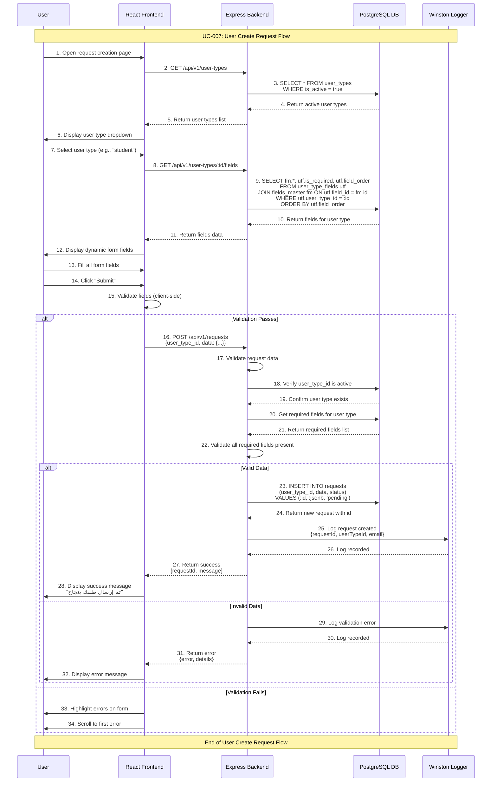

# User Create Request Use Case

## Use Case: UC-007 - User Create New Request
**Version:** 1.0  
**Date:** February 14, 2026  
**Author:** System Architect  

---

## Use Case Description
This use case describes the process of a user creating a new request in the dynamic request management system. The user selects a user type from available options, fills in the dynamically displayed form fields based on the selected type, and submits the request. The system validates the data, stores it in the database with a "pending" status, and provides confirmation to the user.

---

## Actors
- **Primary Actor:** User (any person wishing to submit a request)
- **Secondary Actor:** System (Backend Service, Database)
- **External Systems:** PostgreSQL Database, user_types table, user_type_fields table, fields_master table, requests table

---

## Preconditions
1. System is running and publicly accessible
2. At least one active user type exists in the system
3. Active user types have associated fields configured
4. Database connection is active
5. User has access to the request creation page (public URL)

---

## Postconditions

### Success Postconditions
1. New request is created in requests table with status "pending"
2. Request data is stored as JSONB in the data column
3. User receives success confirmation message on screen
4. Request is visible in admin dashboard for review
5. Request creation is logged in system logs
6. Admin can see the new request for processing

### Failure Postconditions
1. No request is created in database
2. Error message is displayed to user
3. User can retry submission with corrected data
4. Failed attempt is logged for debugging

---

## Main Success Scenario

### Step 1: Open Request Creation Page
1. User opens the public request creation URL
2. System loads the request creation page
3. System fetches all active user types from database
4. System displays dropdown with available user types

### Step 2: Select User Type
1. User sees dropdown list of active user types (e.g., student, agent, teacher)
2. User selects desired user type from dropdown
3. System fetches fields associated with selected user type
4. System dynamically renders form fields based on user type configuration

### Step 3: Display Dynamic Fields
1. System retrieves fields from user_type_fields joined with fields_master
2. Fields are displayed in the configured order (field_order)
3. Each field renders according to its field_type:
   - **text:** Standard text input
   - **email:** Email input with validation
   - **tel:** Phone number input
   - **number:** Numeric input
   - **dropdown:** Select dropdown with field_options
   - **textarea:** Multi-line text area
4. Required fields are clearly marked with asterisk (*)
5. User sees intuitive, properly ordered form

### Step 4: Fill Form Fields
1. User fills in all displayed fields
2. Frontend performs real-time validation:
   - Required fields are not empty
   - Email format is valid
   - Phone number format is valid
   - Number fields contain valid numbers
   - Dropdown selections are valid options
3. User corrects any validation errors highlighted in real-time

### Step 5: Submit Request
1. User clicks "Submit" button
2. Frontend performs final validation of all fields
3. System sends POST request to `/api/v1/requests` with:
   - `user_type_id`: Selected user type ID
   - `data`: JSONB object containing all field values
4. Backend validates the submission

### Step 6: Backend Validation and Storage
1. Backend receives request data
2. Backend validates:
   - user_type_id exists and is active
   - All required fields for the user type are present
   - Field values match expected formats
   - Data integrity checks pass
3. Backend inserts record into requests table:
   - `user_type_id`: From submission
   - `data`: JSONB field values
   - `status`: "pending" (default)
   - `created_at`: Current timestamp
4. System logs successful request creation

### Step 7: Confirm Success
1. Backend returns success response with request details
2. Frontend displays confirmation message: "تم إرسال طلبك بنجاح" (Your request has been submitted successfully)
3. User sees request reference number (request ID)
4. User is informed that admin will review the request
5. Form is reset for potential new submission

---

## Alternative Flows

### AF-1: No Active User Types
**Trigger:** No user types are active in the system
1. System fetches user types and finds none active
2. System displays message: "No request types available at this time"
3. User cannot proceed with request creation
4. User is advised to try again later or contact administration

### AF-2: Validation Errors on Submit
**Trigger:** User submits form with invalid or missing data
1. Frontend validation catches errors before sending to backend
2. System highlights invalid fields with error messages:
   - "This field is required"
   - "Please enter a valid email address"
   - "Please enter a valid phone number"
   - "Please select an option"
3. Form scrolls to first error field
4. User corrects errors and resubmits
5. Return to Step 5 of main flow

### AF-3: Backend Validation Failure
**Trigger:** Data passes frontend validation but fails backend checks
1. Backend detects validation issue (e.g., user type deactivated between load and submit)
2. Backend returns error with details
3. Frontend displays error message to user
4. User may need to refresh page and start over
5. Return to Step 1 of main flow

### AF-4: User Changes User Type After Filling Fields
**Trigger:** User selects a different user type after filling some fields
1. User selects new user type from dropdown
2. System fetches new fields for selected type
3. Previous field values are cleared
4. New dynamic fields are rendered
5. User starts filling new form fields
6. Return to Step 3 of main flow

### AF-5: Dropdown Field with Options
**Trigger:** User type includes dropdown fields
1. System renders dropdown field with options from field_options
2. Options are displayed from JSON array (e.g., ["CS", "Engineering", "Medicine"])
3. User selects appropriate option
4. Selected value is included in request data
5. Continue with main flow

---

## Exception Flows

### EF-1: Database Connection Error
**Trigger:** Database is unavailable during any step
1. System cannot connect to database
2. User sees error: "Service temporarily unavailable. Please try again later"
3. Error is logged with technical details
4. User can retry after some time

### EF-2: Network Error During Submission
**Trigger:** Network connection is lost during form submission
1. Request fails to reach the server
2. Frontend displays network error message
3. User's filled data is preserved in the form
4. User can retry submission when connection is restored

### EF-3: Server Error During Processing
**Trigger:** Unexpected server error during request processing
1. Backend encounters internal error
2. System returns 500 error response
3. User sees: "An error occurred. Please try again"
4. Error is logged with stack trace for debugging
5. User can retry submission

---

## Sequence Diagram



---

## Data Flow

### Step 1 - Input: Get User Types
```
GET /api/v1/user-types
```

### Step 1 - Output: User Types List
```json
{
  "success": true,
  "data": [
    { "id": 1, "type_name": "student", "is_active": true },
    { "id": 2, "type_name": "agent", "is_active": true },
    { "id": 3, "type_name": "teacher", "is_active": true }
  ]
}
```

### Step 2 - Input: Get Fields for User Type
```
GET /api/v1/user-types/1/fields
```

### Step 2 - Output: Fields List
```json
{
  "success": true,
  "data": [
    { "field_id": 1, "field_name": "name", "field_label": "الاسم الكامل", "field_type": "text", "field_options": null, "is_required": true, "field_order": 1 },
    { "field_id": 2, "field_name": "email", "field_label": "البريد الإلكتروني", "field_type": "email", "field_options": null, "is_required": true, "field_order": 2 },
    { "field_id": 3, "field_name": "phone", "field_label": "رقم الهاتف", "field_type": "tel", "field_options": null, "is_required": false, "field_order": 3 },
    { "field_id": 4, "field_name": "student_id", "field_label": "الرقم الجامعي", "field_type": "text", "field_options": null, "is_required": true, "field_order": 4 },
    { "field_id": 7, "field_name": "course", "field_label": "التخصص", "field_type": "dropdown", "field_options": ["CS", "Engineering", "Medicine"], "is_required": true, "field_order": 5 }
  ]
}
```

### Step 3 - Input: Submit Request
```json
POST /api/v1/requests
{
  "user_type_id": 1,
  "data": {
    "name": "أحمد محمد",
    "email": "ahmed@mail.com",
    "phone": "0501234567",
    "student_id": "STU001",
    "course": "CS"
  }
}
```

### Step 3 - Output: Success
```json
{
  "success": true,
  "message": "Request submitted successfully",
  "data": {
    "request_id": 1,
    "user_type_id": 1,
    "status": "pending",
    "created_at": "2026-02-14T10:30:00Z"
  }
}
```

### Step 3 - Output: Failure
```json
{
  "success": false,
  "error": "Validation failed",
  "details": {
    "student_id": "This field is required",
    "email": "Please enter a valid email address"
  }
}
```

---

## Technical Requirements

### API Endpoints
```javascript
// Get active user types (Public)
GET /api/v1/user-types

// Get fields for a specific user type (Public)
GET /api/v1/user-types/:id/fields

// Create new request (Public)
POST /api/v1/requests
Content-Type: application/json
```

### Database Operations
```sql
-- Get active user types
SELECT id, type_name FROM user_types WHERE is_active = true;

-- Get fields for user type
SELECT fm.id as field_id, fm.field_name, fm.field_label, fm.field_type, 
       fm.field_options, utf.is_required, utf.field_order
FROM user_type_fields utf
JOIN fields_master fm ON utf.field_id = fm.id
WHERE utf.user_type_id = $1
ORDER BY utf.field_order;

-- Insert new request
INSERT INTO requests (user_type_id, data, status, created_at)
VALUES ($1, $2::jsonb, 'pending', CURRENT_TIMESTAMP)
RETURNING id, user_type_id, status, created_at;
```

### Validation Rules
```javascript
const requestSchema = {
  user_type_id: Joi.number().integer().positive().required(),
  data: Joi.object().required()
};

// Dynamic validation based on user type fields
const validateDynamicFields = (data, requiredFields) => {
  const errors = {};
  requiredFields.forEach(field => {
    if (!data[field.field_name] || data[field.field_name].trim() === '') {
      errors[field.field_name] = `${field.field_label} is required`;
    }
    // Type-specific validation
    if (field.field_type === 'email' && data[field.field_name]) {
      if (!/^[^\s@]+@[^\s@]+\.[^\s@]+$/.test(data[field.field_name])) {
        errors[field.field_name] = 'Invalid email format';
      }
    }
    if (field.field_type === 'tel' && data[field.field_name]) {
      if (!/^[0-9+\-\s()]+$/.test(data[field.field_name])) {
        errors[field.field_name] = 'Invalid phone number format';
      }
    }
  });
  return errors;
};
```

---

## Business Rules

### BR-1: Public Access
- Request creation page is publicly accessible (no authentication required)
- User types list endpoint is public
- User type fields endpoint is public
- Only active user types are shown to users

### BR-2: Dynamic Form Generation
- Form fields are generated dynamically based on user type selection
- Field order is determined by field_order in user_type_fields
- Field types determine input rendering (text, email, dropdown, etc.)
- Required fields must be filled before submission

### BR-3: Data Storage
- All form data is stored as JSONB in the requests.data column
- Request status is automatically set to "pending"
- Each request is linked to a user_type_id
- Timestamps are automatically generated

### BR-4: Validation
- Frontend validation provides immediate feedback
- Backend validation ensures data integrity
- Required fields for the specific user type must be present
- Field type-specific validation is applied (email format, phone format, etc.)

### BR-5: No User Authentication
- Users do not need to create accounts or log in
- Anyone with the URL can submit a request
- No rate limiting on request submission (basic implementation)
- Consider adding CAPTCHA for spam prevention in future

---

## Success Criteria

### Functional Success Criteria
1. ✅ User can see active user types in dropdown
2. ✅ Dynamic fields are displayed based on user type selection
3. ✅ Form validates required and type-specific fields
4. ✅ Request is saved with "pending" status
5. ✅ User receives confirmation message
6. ✅ Request appears in admin dashboard

### Non-Functional Success Criteria
1. ✅ Page loads within 2 seconds
2. ✅ Dynamic fields load within 1 second after type selection
3. ✅ Form provides real-time validation feedback
4. ✅ Mobile-responsive design for all form elements
5. ✅ Accessible form with proper labels and ARIA attributes

---

## Testing Scenarios

### Test Case 1: Successful Request Submission
**Input:** Select "student", fill all required fields correctly  
**Expected:** Request created with "pending" status, success message displayed  
**Verification:** Request visible in admin dashboard  

### Test Case 2: Missing Required Fields
**Input:** Select "student", leave student_id empty  
**Expected:** Validation error: "الرقم الجامعي is required"  
**Verification:** Request not submitted, error highlighted  

### Test Case 3: Invalid Email Format
**Input:** Enter "invalid-email" in email field  
**Expected:** Validation error: "Invalid email format"  
**Verification:** Form not submitted until corrected  

### Test Case 4: Change User Type Mid-Form
**Input:** Fill fields for "student", then switch to "agent"  
**Expected:** Form resets, new fields for "agent" are displayed  
**Verification:** Previous field values are cleared  

### Test Case 5: Dropdown Field Selection
**Input:** Select "student", choose "CS" from course dropdown  
**Expected:** "CS" value included in submitted data  
**Verification:** Request data contains correct course value  

### Test Case 6: No Active User Types
**Input:** All user types are deactivated  
**Expected:** Message: "No request types available"  
**Verification:** Form is not displayed  

---

## UI/UX Requirements

### Request Form Layout
```
┌──────────────────────────────────────────────────┐
│ إنشاء طلب جديد - Create New Request             │
├──────────────────────────────────────────────────┤
│                                                  │
│ نوع المستخدم: [student            ▼]             │
│                                                  │
│ ── Dynamic Fields ──────────────────────────     │
│                                                  │
│ الاسم الكامل *:     [أحمد محمد___________]       │
│ البريد الإلكتروني *: [ahmed@mail.com_____]       │
│ رقم الهاتف:         [0501234567_________]       │
│ الرقم الجامعي *:    [STU001_____________]       │
│ التخصص *:           [CS               ▼]       │
│                                                  │
│              [إرسال الطلب / Submit]               │
│                                                  │
└──────────────────────────────────────────────────┘
```

### Success Message
```
┌──────────────────────────────────────────────────┐
│ ✅ تم إرسال طلبك بنجاح!                          │
│                                                  │
│ رقم الطلب: #1                                    │
│ نوع الطلب: student                               │
│ الحالة: قيد المراجعة ⏳                           │
│                                                  │
│ سيتم إشعارك بنتيجة الطلب عبر البريد الإلكتروني   │
│                                                  │
│      [إنشاء طلب جديد / Create New Request]       │
└──────────────────────────────────────────────────┘
```

---

## Related Use Cases
- **UC-002:** Admin Create User Type (defines available types)
- **UC-005:** Admin View User Types (manages types visibility)
- **UC-006:** Admin View Fields Master (defines available fields)
- **UC-008:** Admin View Requests (admin sees submitted requests)
- **UC-009:** Admin Approve/Reject Request (admin processes request)

---

## Dependencies
- Express.js framework
- PostgreSQL database with proper schema
- Joi validation library
- React frontend with dynamic form rendering
- Winston logging service

---

*This use case document follows the system architecture described in the mindset document and implements Flow 1 (User Create Request) as specified in the detailed flow diagrams and business requirements.*
