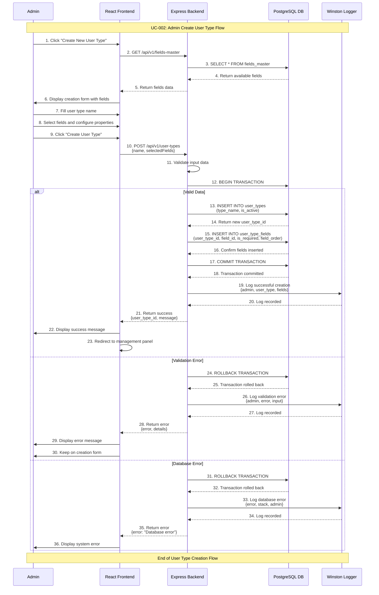

# Admin Create User Type Use Case

## Use Case: UC-002 - Admin Create New User Type
**Version:** 1.0  
**Date:** February 7, 2026  
**Author:** System Architect  

---

## Use Case Description
This use case describes the process of creating a new user type in the user request management system. The admin can define custom user types (such as student, agent, teacher) and configure which fields should be displayed when users of that type create requests. The system provides flexibility by allowing admins to select from predefined fields and set their properties.

---

## Actors
- **Primary Actor:** Admin
- **Secondary Actor:** System (Backend Service, Database)
- **External Systems:** PostgreSQL Database, fields_master table, user_types table, user_type_fields table

---

## Preconditions
1. Admin is authenticated and has valid JWT token
2. Admin has access to admin dashboard
3. fields_master table contains available fields
4. Database connection is active
5. Admin has navigated to User Type Management section

---

## Postconditions

### Success Postconditions
1. New user type is created in user_types table
2. Selected fields are linked to user type in user_type_fields table
3. New user type is available in dropdown for user requests
4. Admin receives success confirmation message
5. User type creation is logged in system logs
6. Admin can view the new user type in management panel

### Failure Postconditions
1. No new user type is created
2. Database remains unchanged
3. Error message is displayed to admin
4. Failed attempt is logged
5. Admin remains on user type creation form

---

## Main Success Scenario

### Step 1: Navigate to User Type Creation
1. Admin clicks on "User Types" in admin dashboard navigation
2. System displays user types management panel
3. Admin sees existing user types list
4. Admin clicks "Create New User Type" button

### Step 2: Display Creation Form
1. System fetches all available fields from fields_master table
2. System displays user type creation form with:
   - User Type Name field
   - Available fields list with checkboxes
   - Field configuration options (required/optional, order)
3. Admin sees clean, intuitive form interface

### Step 3: Fill User Type Information
1. Admin enters user type name (e.g., "contractor", "vendor")
2. System validates name format and uniqueness
3. Admin selects desired fields from fields_master list
4. For each selected field, admin configures:
   - Is Required (checkbox)
   - Field Order (numeric input)

### Step 4: Validate and Submit
1. Admin clicks "Create User Type" button
2. System validates form data:
   - User type name is not empty and unique
   - At least one field is selected
   - Field orders are valid numbers
3. System displays preview of how the form will look to users

### Step 5: Save User Type
1. System begins database transaction
2. Insert new record into user_types table
3. Insert field associations into user_type_fields table
4. Commit transaction if all operations succeed
5. System logs successful creation

### Step 6: Confirm Success
1. Admin receives success message with user type details
2. System redirects to user types management panel
3. New user type appears in the list
4. Admin can see and manage the newly created user type

---

## Alternative Flows

### AF-1: Duplicate User Type Name
**Trigger:** Admin enters name that already exists
1. System validates user type name against existing records
2. System detects duplicate name
3. System returns error: "User type name already exists"
4. Error is highlighted on the name field
5. Admin must enter different name
6. Return to Step 3 of main flow

### AF-2: No Fields Selected
**Trigger:** Admin submits form without selecting any fields
1. System validates that at least one field is selected
2. System detects no fields selected
3. System returns error: "Please select at least one field"
4. Form remains open with error message
5. Admin must select at least one field
6. Return to Step 3 of main flow

### AF-3: Invalid Field Order
**Trigger:** Admin enters duplicate or invalid field order numbers
1. System validates field order values
2. System detects duplicate orders or non-numeric values
3. System returns error: "Field orders must be unique positive numbers"
4. Error is highlighted on affected fields
5. Admin must correct field orders
6. Return to Step 3 of main flow

### AF-4: Database Transaction Failure
**Trigger:** Database error during user type creation
1. System attempts to save user type and fields
2. Database transaction fails (constraint violation, connection error)
3. System rolls back all changes
4. System returns error: "Failed to create user type. Please try again"
5. Error is logged with technical details
6. Return to Step 3 of main flow

---

## Exception Flows

### EF-1: Fields Master Table Empty
**Trigger:** No fields available in fields_master table
1. System attempts to fetch available fields
2. No fields are found in fields_master table
3. System displays error: "No fields available. Please contact system administrator"
4. Admin cannot create user type without available fields
5. System administrator must populate fields_master table

### EF-2: Database Connection Lost
**Trigger:** Database connection fails during operation
1. System loses connection to database
2. System displays error: "Database connection error"
3. Admin cannot proceed with user type creation
4. System attempts to reconnect automatically
5. Admin can retry when connection is restored

### EF-3: Authentication Token Expired
**Trigger:** Admin's JWT token expires during operation
1. System detects expired or invalid token
2. System redirects admin to login page
3. Admin must re-authenticate
4. After login, admin can retry user type creation

---

## Sequence Diagram



---

## Data Flow

### Input Data
```json
{
  "type_name": "contractor",
  "selectedFields": [
    {
      "field_id": 1,
      "is_required": true,
      "field_order": 1
    },
    {
      "field_id": 2,
      "is_required": true,
      "field_order": 2
    },
    {
      "field_id": 3,
      "is_required": false,
      "field_order": 3
    },
    {
      "field_id": 5,
      "is_required": true,
      "field_order": 4
    }
  ]
}
```

### Processing Data
- User type name validation (uniqueness, format)
- Field selection validation (at least one field)
- Field order validation (unique positive numbers)
- Database transaction management
- Audit trail logging

### Output Data (Success)
```json
{
  "success": true,
  "message": "User type created successfully",
  "data": {
    "user_type_id": 4,
    "type_name": "contractor",
    "is_active": true,
    "fields_count": 4,
    "created_at": "2026-02-07T10:15:30Z"
  }
}
```

### Output Data (Failure)
```json
{
  "success": false,
  "error": "Validation failed",
  "details": {
    "type_name": "User type name already exists",
    "selectedFields": "At least one field must be selected"
  }
}
```

---

## Technical Requirements

### API Endpoints
```javascript
// Get available fields
GET /api/v1/fields-master
Authorization: Bearer <jwt_token>

// Create new user type
POST /api/v1/user-types
Content-Type: application/json
Authorization: Bearer <jwt_token>
```

### Database Operations
```sql
-- Check for duplicate name
SELECT COUNT(*) FROM user_types WHERE type_name = $1;

-- Insert new user type
INSERT INTO user_types (type_name, is_active) 
VALUES ($1, true) 
RETURNING id;

-- Insert field associations
INSERT INTO user_type_fields (user_type_id, field_id, is_required, field_order) 
VALUES ($1, $2, $3, $4);
```

### Validation Rules
```javascript
const userTypeSchema = {
  type_name: Joi.string()
    .min(2)
    .max(50)
    .pattern(/^[a-zA-Z0-9_]+$/)
    .required(),
  selectedFields: Joi.array()
    .items(Joi.object({
      field_id: Joi.number().integer().positive().required(),
      is_required: Joi.boolean().required(),
      field_order: Joi.number().integer().positive().required()
    }))
    .min(1)
    .required()
};
```

### Frontend Form Validation
1. **Real-time name validation:** Check uniqueness as admin types
2. **Field order auto-increment:** Suggest next available order number
3. **Visual field preview:** Show how form will look to users
4. **Required field indicators:** Highlight mandatory fields clearly

---

## Business Rules

### BR-1: User Type Naming
- User type names must be unique across the system
- Names can only contain letters, numbers, and underscores
- Names must be between 2-50 characters
- Names are case-insensitive for uniqueness check

### BR-2: Field Selection
- At least one field must be selected for each user type
- Each field can only be associated once per user type
- Field order numbers must be unique within a user type
- Field order determines display sequence in user forms

### BR-3: Field Requirements
- Admin can mark any field as required or optional
- Required fields must be filled by users when creating requests
- Optional fields can be left empty by users
- Field requirements can be changed after user type creation

### BR-4: User Type Status
- New user types are automatically set as active
- Only active user types appear in user request forms
- Admin can deactivate user types to hide them from users
- Deactivated user types preserve existing data

---

## Success Criteria

### Functional Success Criteria
1. ✅ Admin can create new user types with unique names
2. ✅ Admin can select and configure fields for user types
3. ✅ System validates input data and prevents duplicates
4. ✅ New user types appear in management panel
5. ✅ User types become available for user requests immediately

### Non-Functional Success Criteria
1. ✅ User type creation completes within 3 seconds
2. ✅ Form provides real-time validation feedback
3. ✅ Database transactions maintain data consistency
4. ✅ System handles concurrent admin operations safely
5. ✅ All operations are logged for audit purposes

---

## Testing Scenarios

### Test Case 1: Successful User Type Creation
**Input:** Valid name "contractor" with 4 selected fields  
**Expected:** User type created with success message  
**Verification:** New user type appears in management panel  

### Test Case 2: Duplicate Name Prevention
**Input:** User type name "student" (already exists)  
**Expected:** "User type name already exists" error  
**Verification:** No new record created in database  

### Test Case 3: No Fields Selected
**Input:** Valid name but no fields selected  
**Expected:** "Please select at least one field" error  
**Verification:** Form remains open with error message  

### Test Case 4: Invalid Field Order
**Input:** Two fields with same order number  
**Expected:** "Field orders must be unique" error  
**Verification:** Admin must correct order numbers  

### Test Case 5: Database Transaction
**Input:** Valid data but database connection fails mid-transaction  
**Expected:** All changes rolled back, error message displayed  
**Verification:** No partial data saved in any table  

### Test Case 6: Form Preview
**Input:** Select fields and configure properties  
**Expected:** Live preview shows user form layout  
**Verification:** Preview matches actual user request form  

---

## UI/UX Requirements

### Form Layout
```
┌─────────────────────────────────────────────┐
│ Create New User Type                        │
├─────────────────────────────────────────────┤
│ User Type Name: [contractor            ] *  │
│                                             │
│ Available Fields:                           │
│ ☑ Name                 Required ☑  Order: 1 │
│ ☑ Email                Required ☑  Order: 2 │
│ ☐ Phone               Required ☐  Order: 3 │
│ ☑ License Number      Required ☑  Order: 4 │
│ ☐ Company             Required ☐  Order: 5 │
│ ☐ Experience          Required ☐  Order: 6 │
│                                             │
│ Form Preview:                               │
│ ┌─────────────────────────────────────────┐ │
│ │ Name: [_______________] *               │ │
│ │ Email: [_______________] *              │ │
│ │ License Number: [_______________] *     │ │
│ └─────────────────────────────────────────┘ │
│                                             │
│ [Cancel]  [Create User Type]                │
└─────────────────────────────────────────────┘
```

### Success Message
```
✅ User type "contractor" created successfully!
   - 3 required fields, 1 optional field
   - Available for user requests immediately
   [View User Types] [Create Another]
```

---

## Related Use Cases
- **UC-001:** Admin Authentication
- **UC-003:** Admin Edit User Type
- **UC-004:** Admin Delete User Type
- **UC-005:** Admin View User Types
- **UC-006:** User Create Request (uses created user types)

---

## Dependencies
- Express.js framework with JWT middleware
- PostgreSQL database with proper indexes
- Joi validation library
- React frontend with form validation
- Winston logging service
- Database transaction support

---

*This use case document follows the system architecture described in the mindset document and implements the admin user type creation flow as specified in the database schema and business requirements.*