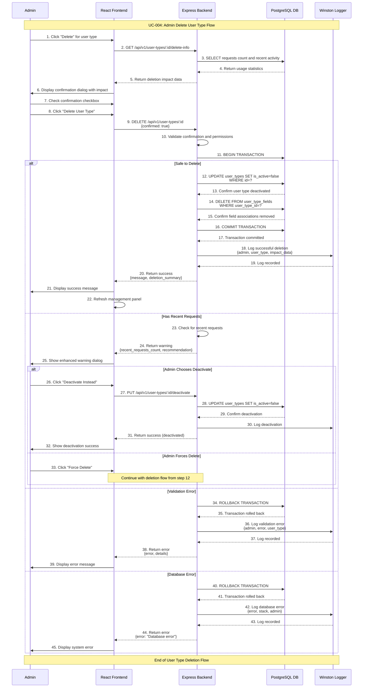

# Admin Delete User Type Use Case

## Use Case: UC-004 - Admin Delete User Type
**Version:** 1.0  
**Date:** February 7, 2026  
**Author:** System Architect  

---

## Use Case Description
This use case describes the process of deleting a user type from the user request management system. The admin can safely remove user types while ensuring data integrity and handling existing requests. The system provides safeguards against accidental deletion and maintains historical data consistency.

---

## Actors
- **Primary Actor:** Admin
- **Secondary Actor:** System (Backend Service, Database)
- **External Systems:** PostgreSQL Database, user_types table, user_type_fields table, requests table

---

## Preconditions
1. Admin is authenticated and has valid JWT token
2. Admin has access to admin dashboard
3. At least one user type exists in the system
4. Database connection is active
5. Admin has navigated to User Type Management section
6. User type to be deleted exists and is accessible

---

## Postconditions

### Success Postconditions
1. User type is marked as inactive or deleted from user_types table
2. Associated field mappings are removed from user_type_fields table
3. User type is no longer available in user request forms
4. Existing requests with this user type remain intact and viewable
5. Admin receives success confirmation message
6. Delete operation is logged in system logs

### Failure Postconditions
1. User type remains in system unchanged
2. No data is modified in database
3. Error message is displayed to admin
4. Failed attempt is logged
5. Admin remains on management panel with user type still visible

---

## Main Success Scenario

### Step 1: Navigate to Delete User Type
1. Admin is in user types management panel
2. Admin sees list of existing user types
3. Admin clicks "Delete" button for specific user type
4. System validates user type exists and admin has permission

### Step 2: Display Delete Confirmation
1. System checks for existing requests using this user type
2. System counts active and completed requests
3. System displays deletion confirmation dialog with:
   - User type name and details
   - Number of existing requests using this type
   - Warning about data impact
   - Confirmation checkbox: "I understand this action cannot be undone"
4. Admin sees clear warning about consequences

### Step 3: Admin Confirms Deletion
1. Admin reads deletion impact summary
2. Admin checks confirmation checkbox
3. Admin clicks "Delete User Type" button
4. System validates confirmation is checked

### Step 4: Validate Deletion Safety
1. System performs final safety checks:
   - Verify user type exists
   - Check for any recent requests (last 24 hours)
   - Validate no other admins are currently editing this type
2. System determines deletion strategy (soft delete vs hard delete)

### Step 5: Execute Deletion
1. System begins database transaction
2. Mark user type as inactive (is_active = false)
3. Remove field associations from user_type_fields table
4. Update any system references if needed
5. Commit transaction if all operations succeed
6. System logs detailed deletion information

### Step 6: Confirm Success
1. Admin receives success message with deletion summary
2. System refreshes user types management panel
3. Deleted user type no longer appears in active list
4. User type is no longer available in request forms
5. Existing requests remain accessible with "Deleted Type" indicator

---

## Alternative Flows

### AF-1: User Type Has Recent Requests
**Trigger:** User type has requests created in last 24 hours
1. System detects recent requests using this user type
2. System displays enhanced warning dialog:
   - "This user type has X recent requests (last 24 hours)"
   - "Deleting may cause confusion for users who recently submitted"
   - Option to "Deactivate Instead" or "Proceed with Deletion"
3. If admin chooses "Deactivate Instead":
   - Mark user type as inactive but keep all data
   - Return to Step 6 with deactivation success message
4. If admin chooses "Proceed", continue to Step 5

### AF-2: User Type Has Many Active Requests
**Trigger:** User type has more than 50 active requests
1. System counts active requests using this user type
2. System displays strong warning dialog:
   - "This user type has X active requests"
   - "Deletion will make request history harder to interpret"
   - Recommendation to deactivate instead of delete
   - Options: "Deactivate Only", "Force Delete", "Cancel"
3. Admin must explicitly choose "Force Delete" to proceed
4. Continue to Step 5 with enhanced logging

### AF-3: Admin Cancels Deletion
**Trigger:** Admin clicks "Cancel" in confirmation dialog
1. System closes confirmation dialog
2. No changes are made to database
3. Admin returns to user types management panel
4. User type remains unchanged and available

### AF-4: Last User Type Deletion
**Trigger:** Admin attempts to delete the only remaining user type
1. System detects this is the last active user type
2. System displays error: "Cannot delete the last user type. System requires at least one active user type."
3. Deletion is blocked and cannot proceed
4. Admin must create another user type before deleting this one
5. Return to user types management panel

### AF-5: Database Transaction Failure
**Trigger:** Database error during user type deletion
1. System attempts to delete user type and associations
2. Database transaction fails (foreign key constraint, connection error)
3. System rolls back all changes
4. System returns error: "Failed to delete user type. Please try again"
5. Error is logged with technical details
6. User type remains unchanged in system

---

## Exception Flows

### EF-1: User Type Not Found
**Trigger:** User type is deleted by another admin during confirmation
1. Admin confirms deletion but user type no longer exists
2. System attempts to find user type for deletion
3. System displays info message: "User type has already been deleted"
4. Admin is returned to refreshed management panel
5. No further action needed

### EF-2: Database Connection Lost
**Trigger:** Database connection fails during deletion
1. System loses connection to database during operation
2. System displays error: "Database connection error during deletion"
3. Admin cannot complete deletion
4. System attempts to reconnect automatically
5. Admin can retry deletion when connection is restored

### EF-3: Concurrent Modification
**Trigger:** Another admin modifies user type during deletion process
1. System detects user type was modified after confirmation dialog opened
2. System displays warning: "User type was modified by another admin"
3. Admin can choose to:
   - "Refresh and retry" (show updated information)
   - "Force delete anyway" (proceed with deletion)
   - "Cancel" (abort deletion)
4. If refreshing, return to Step 2 with updated data

---

## Sequence Diagram



---

## Data Flow

### Input Data
```json
{
  "user_type_id": 3,
  "confirmed": true,
  "force_delete": false
}
```

### Pre-deletion Analysis
```json
{
  "user_type": {
    "id": 3,
    "type_name": "contractor",
    "is_active": true,
    "created_at": "2026-01-15T10:00:00Z"
  },
  "usage_statistics": {
    "total_requests": 25,
    "active_requests": 5,
    "recent_requests_24h": 2,
    "last_request_date": "2026-02-06T15:30:00Z"
  },
  "safety_check": {
    "is_last_user_type": false,
    "has_recent_activity": true,
    "concurrent_edits": false
  }
}
```

### Output Data (Success)
```json
{
  "success": true,
  "message": "User type deleted successfully",
  "data": {
    "user_type_id": 3,
    "type_name": "contractor",
    "deletion_type": "soft_delete",
    "affected_requests": 25,
    "deleted_at": "2026-02-07T16:45:30Z"
  },
  "summary": {
    "action": "deactivated",
    "reason": "preserve_request_history",
    "existing_requests_preserved": true
  }
}
```

### Output Data (Failure)
```json
{
  "success": false,
  "error": "Cannot delete last user type",
  "details": {
    "reason": "system_requires_minimum_one_type",
    "suggestion": "Create another user type before deleting this one",
    "current_active_types": 1
  }
}
```

---

## Technical Requirements

### API Endpoints
```javascript
// Get deletion impact information
GET /api/v1/user-types/:id/delete-info
Authorization: Bearer <jwt_token>

// Delete user type
DELETE /api/v1/user-types/:id
Content-Type: application/json
Authorization: Bearer <jwt_token>

// Deactivate user type (alternative to deletion)
PUT /api/v1/user-types/:id/deactivate
Authorization: Bearer <jwt_token>
```

### Database Operations
```sql
-- Check usage statistics
SELECT 
  COUNT(*) as total_requests,
  COUNT(CASE WHEN status = 'pending' THEN 1 END) as active_requests,
  COUNT(CASE WHEN created_at > NOW() - INTERVAL '24 hours' THEN 1 END) as recent_requests
FROM requests 
WHERE user_type_id = $1;

-- Check if last active user type
SELECT COUNT(*) FROM user_types WHERE is_active = true AND id != $1;

-- Soft delete user type
UPDATE user_types 
SET is_active = false, updated_at = CURRENT_TIMESTAMP 
WHERE id = $1;

-- Remove field associations
DELETE FROM user_type_fields WHERE user_type_id = $1;

-- Hard delete (if chosen)
DELETE FROM user_types WHERE id = $1;
```

### Safety Validation Rules
```javascript
const deletionValidation = {
  // Cannot delete if it's the last user type
  minimumActiveTypes: 1,
  
  // Warning thresholds
  recentRequestsWarning: {
    timeframe: 24, // hours
    threshold: 1   // requests
  },
  
  // High usage warning
  highUsageWarning: {
    activeRequestsThreshold: 50,
    totalRequestsThreshold: 100
  },
  
  // Force delete requirements
  forceDelete: {
    requireExplicitConfirmation: true,
    logWithHighPriority: true
  }
};
```

---

## Business Rules

### BR-1: Minimum System Requirements
- System must maintain at least one active user type at all times
- Cannot delete the last remaining user type
- Admin must create replacement before deleting last type
- System enforces this constraint at database and application level

### BR-2: Data Preservation
- Existing requests are never deleted when user type is removed
- Request data remains fully accessible with historical context
- Deleted user types show as "Deleted Type" in request views
- Request form data structure is preserved in JSONB format

### BR-3: Deletion Strategy
- **Soft Delete (Default):** Mark as inactive, preserve all relationships
- **Hard Delete:** Only if explicitly requested and no dependencies exist
- **Deactivation:** Hide from forms but keep all data intact
- Strategy is automatically determined based on usage patterns

### BR-4: Safety Measures
- Recent activity (24 hours) triggers enhanced warnings
- High usage (50+ requests) requires explicit force confirmation
- Last-minute concurrent changes abort deletion process
- All deletion attempts are logged regardless of outcome

---

## Success Criteria

### Functional Success Criteria
1. ✅ Admin can safely delete user types with appropriate warnings
2. ✅ System prevents deletion of last user type
3. ✅ Existing request data is preserved and accessible
4. ✅ Deleted user types are removed from new request forms
5. ✅ Clear feedback provided about deletion impact

### Non-Functional Success Criteria
1. ✅ Deletion process completes within 3 seconds
2. ✅ Confirmation dialog provides comprehensive impact information
3. ✅ Database constraints prevent data corruption
4. ✅ All deletion attempts are logged for audit
5. ✅ System handles concurrent operations safely

---

## Testing Scenarios

### Test Case 1: Standard User Type Deletion
**Input:** Delete user type with moderate usage (10 requests, no recent activity)  
**Expected:** Soft delete successful, user type marked inactive  
**Verification:** User type hidden from forms, existing requests accessible  

### Test Case 2: Last User Type Protection
**Input:** Attempt to delete the only active user type  
**Expected:** Deletion blocked with clear error message  
**Verification:** User type remains active, error message displayed  

### Test Case 3: Recent Activity Warning
**Input:** Delete user type with requests in last 24 hours  
**Expected:** Enhanced warning dialog with deactivate option  
**Verification:** Admin can choose deactivation over deletion  

### Test Case 4: High Usage Warning
**Input:** Delete user type with 75 active requests  
**Expected:** Strong warning with force delete requirement  
**Verification:** Admin must explicitly confirm force delete  

### Test Case 5: Concurrent Modification
**Input:** Another admin edits user type during deletion confirmation  
**Expected:** Deletion aborted with refresh option  
**Verification:** Admin sees updated information before proceeding  

### Test Case 6: Database Transaction Failure
**Input:** Valid deletion but constraint violation occurs  
**Expected:** All changes rolled back, original state preserved  
**Verification:** No partial deletions in database  

---

## UI/UX Requirements

### Deletion Confirmation Dialog
```
┌─────────────────────────────────────────────┐
│ ⚠️  Delete User Type: "contractor"           │
├─────────────────────────────────────────────┤
│ This action will permanently remove this    │
│ user type from your system.                 │
│                                             │
│ Impact Summary:                             │
│ • 25 existing requests will be preserved   │
│ • 5 active requests (status: pending)      │
│ • 2 recent requests (last 24 hours)        │
│ • Type will be removed from new forms      │
│                                             │
│ ⚠️  Recent Activity Warning:                 │
│ This type was used 2 times in the last     │
│ 24 hours. Consider deactivating instead.   │
│                                             │
│ ☐ I understand this action cannot be undone│
│                                             │
│ [Cancel] [Deactivate Instead] [Delete Type] │
└─────────────────────────────────────────────┘
```

### Success Message
```
✅ User type "contractor" deleted successfully!
   - Type removed from request forms
   - 25 existing requests preserved and accessible
   - Action logged for audit purposes
   [View User Types] [Create New Type]
```

### Warning for Last Type
```
🚫 Cannot Delete User Type

You cannot delete "student" because it's the only 
active user type in your system.

The system requires at least one user type to function.
Please create another user type before deleting this one.

[Create New Type] [Close]
```

---

## Related Use Cases
- **UC-001:** Admin Authentication
- **UC-002:** Admin Create User Type (needed for replacement)
- **UC-003:** Admin Edit User Type
- **UC-005:** Admin View User Types
- **UC-006:** User Create Request (affected by deletion)

---

## Dependencies
- Express.js framework with JWT middleware
- PostgreSQL database with foreign key constraints
- Joi validation library for request validation
- React frontend with confirmation dialogs
- Winston logging service for audit trail
- Database transaction support for data integrity

---

*This use case document ensures safe deletion of user types while maintaining data integrity and providing clear feedback about the impact of deletion operations.*