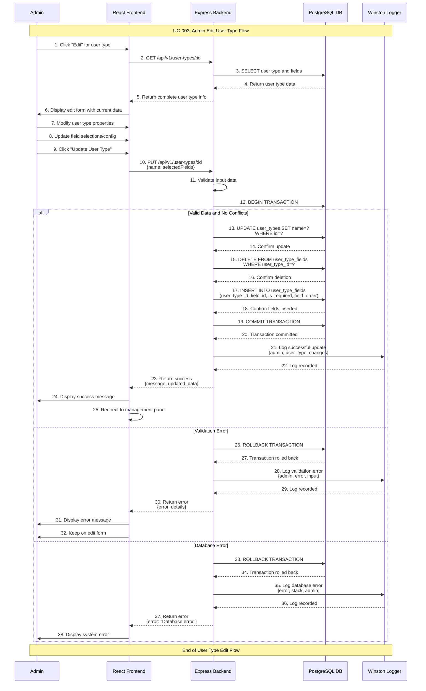

# Admin Edit User Type Use Case

## Use Case: UC-003 - Admin Edit Existing User Type
**Version:** 1.0  
**Date:** February 7, 2026  
**Author:** System Architect  

---

## Use Case Description
This use case describes the process of editing an existing user type in the user request management system. The admin can modify user type properties including name, associated fields, field requirements, and field order. The system ensures data consistency and handles existing requests that use the modified user type.

---

## Actors
- **Primary Actor:** Admin
- **Secondary Actor:** System (Backend Service, Database)
- **External Systems:** PostgreSQL Database, user_types table, user_type_fields table, requests table

---

## Preconditions
1. Admin is authenticated and has valid JWT token
2. Admin has access to admin dashboard
3. At least one user type exists in the system
4. Database connection is active
5. Admin has navigated to User Type Management section
6. User type to be edited exists and is accessible

---

## Postconditions

### Success Postconditions
1. User type is updated in user_types table
2. Field associations are updated in user_type_fields table
3. Changes are reflected in user request forms immediately
4. Admin receives success confirmation message
5. Edit operation is logged in system logs
6. Existing requests remain valid with old field structure

### Failure Postconditions
1. No changes are made to user type
2. Database remains unchanged
3. Error message is displayed to admin
4. Failed attempt is logged
5. Admin remains on edit form with current data

---

## Main Success Scenario

### Step 1: Navigate to Edit User Type
1. Admin is in user types management panel
2. Admin sees list of existing user types
3. Admin clicks "Edit" button for specific user type
4. System validates user type exists and is editable

### Step 2: Display Edit Form
1. System fetches current user type data from user_types table
2. System fetches associated fields from user_type_fields table
3. System fetches all available fields from fields_master table
4. System displays edit form pre-populated with current data:
   - User Type Name field (current value)
   - Available fields list with current selections checked
   - Field configuration (required/optional, order) with current values
5. Admin sees clear indication this is edit mode

### Step 3: Modify User Type Information
1. Admin modifies user type name if needed
2. System validates name format and uniqueness (excluding current record)
3. Admin adds/removes fields from selection
4. Admin modifies field configurations:
   - Toggle Required status (checkbox)
   - Update Field Order (numeric input)
5. System provides real-time validation feedback

### Step 4: Preview Changes
1. Admin reviews modifications in form preview
2. System shows comparison between old and new field structure
3. System displays warning if changes affect existing requests
4. Admin confirms understanding of impact on existing data

### Step 5: Save Changes
1. Admin clicks "Update User Type" button
2. System validates all form data:
   - User type name is unique (excluding current record)
   - At least one field is selected
   - Field orders are valid and unique
3. System displays summary of changes to be made

### Step 6: Update Database
1. System begins database transaction
2. Update user_types table with new name if changed
3. Delete existing field associations from user_type_fields
4. Insert new field associations into user_type_fields
5. Commit transaction if all operations succeed
6. System logs successful update with change details

### Step 7: Confirm Success
1. Admin receives success message with change summary
2. System redirects to user types management panel
3. Updated user type appears in the list with new configuration
4. Changes are immediately available for new user requests

---

## Alternative Flows

### AF-1: Duplicate User Type Name
**Trigger:** Admin enters name that already exists for another user type
1. System validates user type name against other existing records
2. System detects duplicate name
3. System returns error: "User type name already exists"
4. Error is highlighted on the name field
5. Admin must enter different name
6. Return to Step 3 of main flow

### AF-2: No Fields Selected
**Trigger:** Admin unchecks all fields
1. System validates that at least one field is selected
2. System detects no fields selected
3. System returns error: "Please select at least one field"
4. Form remains open with error message
5. Admin must select at least one field
6. Return to Step 3 of main flow

### AF-3: Invalid Field Order
**Trigger:** Admin enters duplicate or invalid field order numbers
1. System validates field order values
2. System detects duplicate orders or non-numeric values
3. System returns error: "Field orders must be unique positive numbers"
4. Error is highlighted on affected fields
5. Admin must correct field orders
6. Return to Step 3 of main flow

### AF-4: User Type Has Active Requests
**Trigger:** Admin attempts to remove required fields used in existing requests
1. System checks for existing requests using the user type
2. System detects active requests that would be affected
3. System shows warning: "X active requests use this user type. Changes may affect existing data."
4. Admin can choose to:
   - Continue with changes (existing requests keep old structure)
   - Cancel edit operation
   - Modify changes to minimize impact
5. If continuing, return to Step 6 of main flow

### AF-5: Database Transaction Failure
**Trigger:** Database error during user type update
1. System attempts to save user type changes
2. Database transaction fails (constraint violation, connection error)
3. System rolls back all changes
4. System returns error: "Failed to update user type. Please try again"
5. Error is logged with technical details
6. Return to Step 3 of main flow

---

## Exception Flows

### EF-1: User Type Not Found
**Trigger:** User type is deleted by another admin while editing
1. System attempts to load user type data
2. User type no longer exists in database
3. System displays error: "User type not found. It may have been deleted."
4. Admin is redirected to user types management panel
5. Admin must select a different user type to edit

### EF-2: Database Connection Lost
**Trigger:** Database connection fails during operation
1. System loses connection to database
2. System displays error: "Database connection error"
3. Admin cannot proceed with user type update
4. System attempts to reconnect automatically
5. Admin can retry when connection is restored

### EF-3: Authentication Token Expired
**Trigger:** Admin's JWT token expires during operation
1. System detects expired or invalid token
2. System redirects admin to login page
3. Admin must re-authenticate
4. After login, admin can retry user type edit

---

## Sequence Diagram



---

## Data Flow

### Input Data
```json
{
  "id": 2,
  "type_name": "contractor_updated",
  "selectedFields": [
    {
      "field_id": 1,
      "is_required": true,
      "field_order": 1
    },
    {
      "field_id": 2,
      "is_required": true,
      "field_order": 2
    },
    {
      "field_id": 4,
      "is_required": false,
      "field_order": 3
    }
  ]
}
```

### Processing Data
- User type name validation (uniqueness excluding current record)
- Field selection validation (at least one field)
- Field order validation (unique positive numbers)
- Impact analysis on existing requests
- Database transaction management
- Change tracking and audit logging

### Output Data (Success)
```json
{
  "success": true,
  "message": "User type updated successfully",
  "data": {
    "user_type_id": 2,
    "type_name": "contractor_updated",
    "is_active": true,
    "fields_count": 3,
    "updated_at": "2026-02-07T14:30:45Z",
    "changes": {
      "name_changed": true,
      "fields_added": 1,
      "fields_removed": 1,
      "requirements_changed": 2
    }
  }
}
```

### Output Data (Failure)
```json
{
  "success": false,
  "error": "Validation failed",
  "details": {
    "type_name": "User type name already exists",
    "field_orders": "Duplicate field order: 2"
  }
}
```

---

## Technical Requirements

### API Endpoints
```javascript
// Get specific user type with fields
GET /api/v1/user-types/:id
Authorization: Bearer <jwt_token>

// Update existing user type
PUT /api/v1/user-types/:id
Content-Type: application/json
Authorization: Bearer <jwt_token>
```

### Database Operations
```sql
-- Get user type with associated fields
SELECT ut.*, utf.field_id, utf.is_required, utf.field_order, fm.field_label
FROM user_types ut
JOIN user_type_fields utf ON ut.id = utf.user_type_id
JOIN fields_master fm ON utf.field_id = fm.id
WHERE ut.id = $1;

-- Check for duplicate name (excluding current record)
SELECT COUNT(*) FROM user_types 
WHERE type_name = $1 AND id != $2;

-- Update user type name
UPDATE user_types 
SET type_name = $1, updated_at = CURRENT_TIMESTAMP 
WHERE id = $2;

-- Remove existing field associations
DELETE FROM user_type_fields WHERE user_type_id = $1;

-- Insert new field associations
INSERT INTO user_type_fields (user_type_id, field_id, is_required, field_order) 
VALUES ($1, $2, $3, $4);
```

### Validation Rules
```javascript
const updateUserTypeSchema = {
  type_name: Joi.string()
    .min(2)
    .max(50)
    .pattern(/^[a-zA-Z0-9_]+$/)
    .required(),
  selectedFields: Joi.array()
    .items(Joi.object({
      field_id: Joi.number().integer().positive().required(),
      is_required: Joi.boolean().required(),
      field_order: Joi.number().integer().positive().required()
    }))
    .min(1)
    .required()
};
```

### Change Impact Analysis
```javascript
// Check existing requests before field removal
const checkRequestImpact = async (userTypeId, removedFields) => {
  const activeRequests = await db.query(`
    SELECT COUNT(*) as count 
    FROM requests 
    WHERE user_type_id = $1 AND status = 'pending'
  `, [userTypeId]);
  
  return {
    hasActiveRequests: activeRequests.rows[0].count > 0,
    requestCount: activeRequests.rows[0].count
  };
};
```

---

## Business Rules

### BR-1: Name Uniqueness
- User type names must remain unique across the system
- Current user type is excluded from uniqueness check
- Names are case-insensitive for uniqueness validation
- Original naming conventions still apply (2-50 characters, alphanumeric + underscore)

### BR-2: Field Modification Impact
- Removing fields doesn't affect existing requests (they keep old structure)
- Adding new required fields only applies to new requests
- Field order changes apply immediately to new request forms
- Existing requests maintain their original field structure

### BR-3: Data Consistency
- All changes must be applied atomically (all or nothing)
- Field associations are completely replaced, not merged
- User type status (active/inactive) is preserved unless explicitly changed
- Update timestamps are automatically maintained

### BR-4: Concurrent Editing
- No locking mechanism - last save wins
- Admin receives warning if user type was modified by another admin
- Changes are immediately visible to all users
- Edit conflicts are logged for audit purposes

---

## Success Criteria

### Functional Success Criteria
1. ✅ Admin can modify user type names and field configurations
2. ✅ System validates changes and prevents conflicts
3. ✅ Existing requests are not affected by user type changes
4. ✅ New requests immediately use updated user type structure
5. ✅ All changes are logged with detailed change tracking

### Non-Functional Success Criteria
1. ✅ User type update completes within 2 seconds
2. ✅ Form provides real-time validation feedback
3. ✅ Database transactions maintain data consistency
4. ✅ System handles concurrent edits gracefully
5. ✅ Change history is maintained for audit purposes

---

## Testing Scenarios

### Test Case 1: Successful Name Change
**Input:** Valid new name "senior_contractor"  
**Expected:** User type name updated, success message displayed  
**Verification:** Name change reflected in management panel  

### Test Case 2: Add Required Field
**Input:** Add new required field to existing user type  
**Expected:** Field added successfully, applies to new requests only  
**Verification:** New requests show additional required field  

### Test Case 3: Remove Field
**Input:** Remove field from user type with existing requests  
**Expected:** Field removed, existing requests unaffected  
**Verification:** Existing requests still show removed field data  

### Test Case 4: Field Order Change
**Input:** Reorder fields for user type  
**Expected:** New field order applied to user request forms  
**Verification:** Request forms show fields in new order  

### Test Case 5: Concurrent Edit Conflict
**Input:** Two admins edit same user type simultaneously  
**Expected:** Both changes apply (last save wins)  
**Verification:** Final state reflects last saved changes  

### Test Case 6: Database Rollback
**Input:** Valid changes but database constraint violation  
**Expected:** All changes rolled back, original state preserved  
**Verification:** No partial updates in database  

---

## UI/UX Requirements

### Edit Form Layout
```
┌─────────────────────────────────────────────┐
│ Edit User Type: contractor                  │
├─────────────────────────────────────────────┤
│ User Type Name: [contractor_updated    ] *  │
│                                             │
│ Available Fields:                           │
│ ☑ Name                 Required ☑  Order: 1 │
│ ☑ Email                Required ☑  Order: 2 │
│ ☐ Phone               Required ☐  Order: - │
│ ☑ License Number      Required ☐  Order: 3 │
│ ☐ Company             Required ☐  Order: - │
│ ☐ Experience          Required ☐  Order: - │
│                                             │
│ ⚠ Warning: 5 active requests use this type │
│                                             │
│ Form Preview:                               │
│ ┌─────────────────────────────────────────┐ │
│ │ Name: [_______________] *               │ │
│ │ Email: [_______________] *              │ │
│ │ License Number: [_______________]       │ │
│ └─────────────────────────────────────────┘ │
│                                             │
│ [Cancel]  [Update User Type]                │
└─────────────────────────────────────────────┘
```

### Success Message
```
✅ User type "contractor_updated" updated successfully!
   - Name changed from "contractor" to "contractor_updated"
   - 1 field added, 1 field removed
   - Changes apply to new requests immediately
   [View User Types] [Edit Another]
```

### Warning Messages
```
⚠️ Impact Warning:
   This user type has 5 active requests. Your changes will:
   - Apply immediately to new requests
   - Not affect existing request data
   - May create inconsistency in field requirements
   
   [Continue] [Cancel] [Review Changes]
```

---

## Related Use Cases
- **UC-001:** Admin Authentication
- **UC-002:** Admin Create User Type
- **UC-004:** Admin Delete User Type
- **UC-005:** Admin View User Types
- **UC-006:** User Create Request (affected by user type changes)

---

## Dependencies
- Express.js framework with JWT middleware
- PostgreSQL database with transaction support
- Joi validation library
- React frontend with form validation
- Winston logging service
- Real-time form validation and preview

---

*This use case document enables admins to modify existing user types while maintaining system consistency and preserving existing request data integrity.*