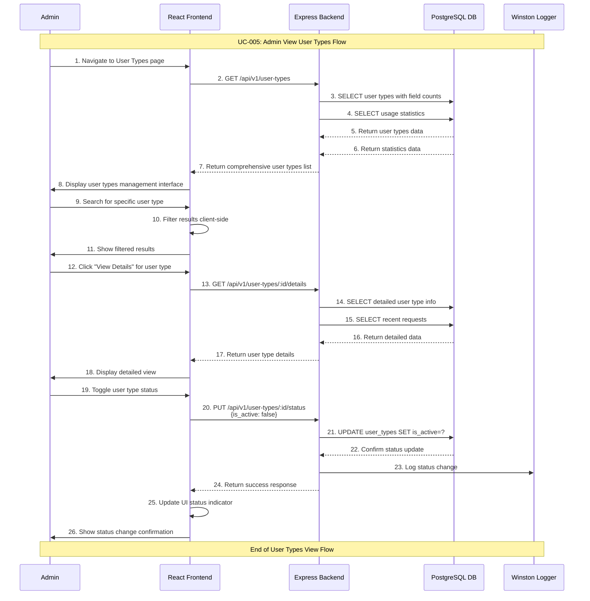

# Admin View User Types Use Case

## Use Case: UC-005 - Admin View User Types Management
**Version:** 1.0  
**Date:** February 7, 2026  
**Author:** System Architect  

---

## Use Case Description
This use case describes the process of viewing and managing user types in the admin dashboard. The admin can see a comprehensive list of all user types, view their details, see usage statistics, and perform management actions. The interface provides sorting, filtering, and search capabilities for efficient user type management.

---

## Actors
- **Primary Actor:** Admin
- **Secondary Actor:** System (Backend Service, Database)
- **External Systems:** PostgreSQL Database, user_types table, user_type_fields table, requests table, fields_master table

---

## Preconditions
1. Admin is authenticated and has valid JWT token
2. Admin has access to admin dashboard
3. Database connection is active
4. Admin has navigated to User Type Management section

---

## Postconditions

### Success Postconditions
1. Admin sees complete list of user types with current status
2. Usage statistics are displayed for each user type
3. Management actions are available for each user type
4. Admin can efficiently find and manage specific user types
5. Page load and interactions are logged for audit

### Failure Postconditions
1. Error message is displayed if data cannot be loaded
2. Admin sees fallback interface with retry options
3. Failed attempts are logged for debugging
4. System provides guidance for troubleshooting

---

## Main Success Scenario

### Step 1: Navigate to User Types Management
1. Admin clicks on "User Types" in admin dashboard navigation
2. System validates admin permissions
3. Admin is directed to user types management page
4. Loading indicator is displayed while data is fetched

### Step 2: Fetch User Types Data
1. System retrieves all user types from database
2. System fetches associated field information for each type
3. System calculates usage statistics for each type:
   - Total requests count
   - Active requests count
   - Last used date
   - Creation date
4. System prepares data for display with proper formatting

### Step 3: Display User Types List
1. System renders user types management interface with:
   - Header with total count and management options
   - Search bar for filtering user types
   - Sort options (name, created date, usage, status)
   - User types table with comprehensive information
   - Action buttons for each user type (View, Edit, Delete)
2. Admin sees clear, organized view of all user types

### Step 4: Interactive Management Features
1. Admin can use search to find specific user types
2. Admin can sort list by different criteria
3. Admin can filter by status (active, inactive)
4. Admin can view detailed information in expandable rows
5. Admin can access management actions directly from list

### Step 5: View User Type Details
1. Admin clicks on user type name or "View Details" button
2. System displays detailed view with:
   - User type information (name, status, dates)
   - Associated fields with configuration
   - Usage statistics and analytics
   - Recent requests using this type
   - Management action buttons
3. Admin can navigate between different user types

### Step 6: Perform Management Actions
1. Admin sees available actions for each user type:
   - "Edit" - Navigate to edit form (UC-003)
   - "Delete" - Initiate deletion process (UC-004)
   - "Duplicate" - Create copy with modified name
   - "Activate/Deactivate" - Toggle user type status
2. Admin can perform actions directly from the list or detail view
3. System provides appropriate feedback for each action

---

## Alternative Flows

### AF-1: No User Types Exist
**Trigger:** Database has no user types
1. System detects empty user_types table
2. System displays empty state interface with:
   - Message: "No user types found"
   - Explanation of user type purpose
   - "Create First User Type" prominent button
   - Link to documentation or help
3. Admin can immediately create a user type
4. Return to main flow once user type is created

### AF-2: Large Dataset Performance
**Trigger:** System has many user types (>100)
1. System implements pagination for performance
2. System displays paginated results with:
   - Page size options (25, 50, 100 per page)
   - Navigation controls (previous, next, page numbers)
   - Total count information
   - Search functionality remains available
3. Admin can navigate through pages efficiently
4. Search and filters work across all pages

### AF-3: Search and Filter Usage
**Trigger:** Admin uses search or filter functionality
1. Admin enters search terms in search bar
2. System filters results in real-time as admin types
3. System shows filtered results with:
   - Match highlighting in user type names
   - Filter tags showing active filters
   - "Clear filters" option
   - Result count information
4. Admin can combine multiple filters
5. Results update dynamically with each filter change

### AF-4: User Type Status Management
**Trigger:** Admin toggles user type active/inactive status
1. Admin clicks status toggle switch for a user type
2. System displays confirmation dialog:
   - Current status and proposed change
   - Impact on new request forms
   - Effect on existing requests (none)
3. Admin confirms status change
4. System updates database and refreshes display
5. Status change is logged for audit

---

## Exception Flows

### EF-1: Database Connection Error
**Trigger:** Database is unavailable when loading page
1. System cannot retrieve user types data
2. System displays error message:
   - "Unable to load user types"
   - Technical error details (for admin)
   - "Retry" button
   - "Contact Support" option
3. System logs error with stack trace
4. Admin can retry loading or contact support

### EF-2: Partial Data Load Failure
**Trigger:** Some user type data cannot be loaded
1. System successfully loads some user types but fails on others
2. System displays partial results with warning:
   - "Some user types could not be loaded"
   - List of successfully loaded types
   - "Retry" option for failed items
3. Admin can work with available data
4. Failed items are logged for investigation

### EF-3: Authentication Token Expired
**Trigger:** Admin's JWT token expires during page usage
1. System detects expired token during data refresh
2. System displays session expired message
3. Admin is redirected to login page with return URL
4. After re-authentication, admin returns to user types page
5. Page reloads with fresh data

---

## Sequence Diagram



---

## Data Flow

### Request Data
```javascript
// Initial page load
GET /api/v1/user-types?include=fields,stats

// Search and filter
GET /api/v1/user-types?search=contractor&status=active&sort=name

// Detailed view
GET /api/v1/user-types/:id/details
```

### Response Data Structure
```json
{
  "success": true,
  "data": {
    "user_types": [
      {
        "id": 1,
        "type_name": "student",
        "is_active": true,
        "created_at": "2026-01-15T10:00:00Z",
        "updated_at": "2026-02-01T14:30:00Z",
        "fields_count": 6,
        "fields": [
          {
            "field_id": 1,
            "field_name": "name",
            "field_label": "الاسم الكامل",
            "is_required": true,
            "field_order": 1
          },
          {
            "field_id": 2,
            "field_name": "email",
            "field_label": "البريد الإلكتروني",
            "is_required": true,
            "field_order": 2
          }
        ],
        "usage_stats": {
          "total_requests": 45,
          "active_requests": 12,
          "completed_requests": 30,
          "rejected_requests": 3,
          "last_used": "2026-02-06T16:20:00Z",
          "most_recent_request_id": 123
        }
      },
      {
        "id": 2,
        "type_name": "contractor",
        "is_active": true,
        "created_at": "2026-01-20T09:15:00Z",
        "updated_at": "2026-01-20T09:15:00Z",
        "fields_count": 4,
        "fields": [
          {
            "field_id": 1,
            "field_name": "name",
            "field_label": "اسم المقاول",
            "is_required": true,
            "field_order": 1
          },
          {
            "field_id": 5,
            "field_name": "license_number",
            "field_label": "رقم الترخيص",
            "is_required": true,
            "field_order": 2
          }
        ],
        "usage_stats": {
          "total_requests": 8,
          "active_requests": 3,
          "completed_requests": 5,
          "rejected_requests": 0,
          "last_used": "2026-02-05T11:45:00Z",
          "most_recent_request_id": 118
        }
      }
    ],
    "metadata": {
      "total_count": 2,
      "active_count": 2,
      "inactive_count": 0,
      "page": 1,
      "per_page": 25,
      "total_pages": 1
    }
  }
}
```

### Detailed View Response
```json
{
  "success": true,
  "data": {
    "user_type": {
      "id": 1,
      "type_name": "student",
      "is_active": true,
      "created_at": "2026-01-15T10:00:00Z",
      "updated_at": "2026-02-01T14:30:00Z"
    },
    "fields": [
      {
        "field_id": 1,
        "field_name": "name",
        "field_label": "الاسم الكامل",
        "field_type": "text",
        "is_required": true,
        "field_order": 1
      }
    ],
    "usage_analytics": {
      "total_requests": 45,
      "status_breakdown": {
        "pending": 12,
        "approved": 25,
        "rejected": 8
      },
      "recent_activity": [
        {
          "request_id": 123,
          "created_at": "2026-02-06T16:20:00Z",
          "status": "pending"
        }
      ],
      "usage_trend": {
        "this_week": 8,
        "last_week": 12,
        "this_month": 35,
        "last_month": 28
      }
    }
  }
}
```

---

## Technical Requirements

### API Endpoints
```javascript
// Get all user types with optional filters
GET /api/v1/user-types
Query Parameters:
  - search: string (filter by name)
  - status: 'active' | 'inactive' | 'all'
  - sort: 'name' | 'created_at' | 'usage' | 'status'
  - order: 'asc' | 'desc'
  - page: number
  - per_page: number
  - include: 'fields,stats,recent'

// Get detailed user type information
GET /api/v1/user-types/:id/details
Authorization: Bearer <jwt_token>

// Update user type status
PUT /api/v1/user-types/:id/status
Content-Type: application/json
Authorization: Bearer <jwt_token>
```

### Database Queries
```sql
-- Main user types list with statistics
SELECT 
  ut.id,
  ut.type_name,
  ut.is_active,
  ut.created_at,
  ut.updated_at,
  COUNT(DISTINCT utf.field_id) as fields_count,
  COUNT(DISTINCT r.id) as total_requests,
  COUNT(DISTINCT CASE WHEN r.status = 'pending' THEN r.id END) as active_requests,
  MAX(r.created_at) as last_used
FROM user_types ut
LEFT JOIN user_type_fields utf ON ut.id = utf.user_type_id
LEFT JOIN requests r ON ut.id = r.user_type_id
WHERE ($1 = '' OR ut.type_name ILIKE $1)
  AND ($2 = 'all' OR ut.is_active = $2::boolean)
GROUP BY ut.id, ut.type_name, ut.is_active, ut.created_at, ut.updated_at
ORDER BY 
  CASE WHEN $3 = 'name' THEN ut.type_name END ASC,
  CASE WHEN $3 = 'created_at' THEN ut.created_at END DESC,
  CASE WHEN $3 = 'usage' THEN COUNT(r.id) END DESC;

-- Detailed user type with fields
SELECT 
  ut.*,
  utf.field_id,
  utf.is_required,
  utf.field_order,
  fm.field_name,
  fm.field_label,
  fm.field_type
FROM user_types ut
LEFT JOIN user_type_fields utf ON ut.id = utf.user_type_id
LEFT JOIN fields_master fm ON utf.field_id = fm.id
WHERE ut.id = $1
ORDER BY utf.field_order;

-- Recent requests for user type
SELECT id, created_at, status, data
FROM requests 
WHERE user_type_id = $1 
ORDER BY created_at DESC 
LIMIT 10;
```

### Frontend State Management
```javascript
const userTypesState = {
  userTypes: [],
  loading: false,
  error: null,
  filters: {
    search: '',
    status: 'all',
    sort: 'name',
    order: 'asc'
  },
  pagination: {
    page: 1,
    perPage: 25,
    totalPages: 1,
    totalCount: 0
  },
  selectedUserType: null
};
```

---

## Business Rules

### BR-1: Display Priority
- Active user types are shown first by default
- Inactive user types are visually distinguished (grayed out)
- Recently created user types are highlighted for first 7 days
- User types with recent activity (24h) show activity indicator

### BR-2: Search and Filtering
- Search is case-insensitive and searches user type names
- Filters can be combined (search + status + sort)
- Search results are highlighted for easy identification
- Empty search shows all user types

### BR-3: Usage Statistics
- Statistics update in real-time when possible
- Cached statistics refresh every 5 minutes
- "Last used" shows most recent request creation date
- Zero usage is clearly indicated as "Never used"

### BR-4: Management Actions
- Actions availability depends on user type status and usage
- Cannot delete user types with recent activity without warning
- Status changes apply immediately to new request forms
- All management actions are logged for audit

---

## Success Criteria

### Functional Success Criteria
1. ✅ Admin can view all user types with comprehensive information
2. ✅ Search and filter functionality works efficiently
3. ✅ Usage statistics provide meaningful insights
4. ✅ Management actions are easily accessible and safe
5. ✅ Interface handles large datasets with good performance

### Non-Functional Success Criteria
1. ✅ Page loads within 2 seconds with up to 1000 user types
2. ✅ Search results appear within 500ms of typing
3. ✅ Interface is responsive on all device sizes
4. ✅ Data refreshes automatically every 5 minutes
5. ✅ All interactions are logged for audit purposes

---

## Testing Scenarios

### Test Case 1: Standard List View
**Input:** Admin navigates to user types management  
**Expected:** List of all user types with statistics displayed  
**Verification:** All user types shown with correct data  

### Test Case 2: Search Functionality
**Input:** Admin searches for "student"  
**Expected:** Only user types containing "student" are shown  
**Verification:** Results filtered correctly, search term highlighted  

### Test Case 3: Status Filter
**Input:** Admin filters by "inactive" status  
**Expected:** Only inactive user types are displayed  
**Verification:** Filter applied correctly, active count shows 0  

### Test Case 4: Sort by Usage
**Input:** Admin sorts by "usage" in descending order  
**Expected:** User types ordered by request count (highest first)  
**Verification:** Sort order matches request statistics  

### Test Case 5: Empty State
**Input:** New system with no user types  
**Expected:** Empty state with create button displayed  
**Verification:** Clear call-to-action for creating first user type  

### Test Case 6: Large Dataset Performance
**Input:** System with 500 user types  
**Expected:** Pagination implemented, page loads quickly  
**Verification:** Page loads under 2 seconds, navigation works  

---

## UI/UX Requirements

### Main Management Interface
```
┌─────────────────────────────────────────────────────────────────┐
│ User Types Management                    [+ Create New Type]    │
├─────────────────────────────────────────────────────────────────┤
│                                                                 │
│ [Search user types...        ] [All▼] [Sort: Name▼]  [🔄]     │
│                                                                 │
│ ┌─────────────────────────────────────────────────────────────┐ │
│ │ Name        │Fields│Requests│Last Used │Status │Actions    │ │
│ ├─────────────────────────────────────────────────────────────┤ │
│ │ student ●   │  6   │  45    │2 hrs ago │Active │[Edit][Del]│ │
│ │ contractor  │  4   │   8    │1 day ago │Active │[Edit][Del]│ │
│ │ agent       │  5   │   0    │Never     │Active │[Edit][Del]│ │
│ │ teacher     │  7   │  23    │1 week ago│Inactive│[Edit][◀] │ │
│ └─────────────────────────────────────────────────────────────┘ │
│                                                                 │
│ Showing 4 of 4 user types                    [1] [2] [3] [>]   │
└─────────────────────────────────────────────────────────────────┘
```

### Detailed View Panel
```
┌─────────────────────────────────────────────────────────────────┐
│ ← Back to List    User Type: student                           │
├─────────────────────────────────────────────────────────────────┤
│                                                                 │
│ General Information:                                            │
│ • Name: student                                                 │
│ • Status: Active ●                                              │
│ • Created: January 15, 2026                                     │
│ • Last Modified: February 1, 2026                               │
│                                                                 │
│ Associated Fields (6):                                          │
│ 1. Name (required)                                              │
│ 2. Email (required)                                             │
│ 3. Student ID (required)                                        │
│ 4. Phone (optional)                                             │
│ 5. Department (required)                                        │
│ 6. Year of Study (optional)                                     │
│                                                                 │
│ Usage Statistics:                                               │
│ • Total Requests: 45                                            │
│ • Active: 12  • Approved: 25  • Rejected: 8                   │
│ • This Week: 8  • Last Week: 12                               │
│ • Last Used: 2 hours ago                                        │
│                                                                 │
│ [Edit User Type] [Delete] [Duplicate] [Deactivate]            │
└─────────────────────────────────────────────────────────────────┘
```

### Empty State
```
┌─────────────────────────────────────────────────────────────────┐
│                    No User Types Found                          │
│                                                                 │
│               📝 Your system has no user types yet              │
│                                                                 │
│        User types define the forms your users will fill        │
│        when submitting requests. Create your first one!        │
│                                                                 │
│                   [Create First User Type]                      │
│                                                                 │
│                    📚 View Documentation                        │
└─────────────────────────────────────────────────────────────────┘
```

---

## Related Use Cases
- **UC-001:** Admin Authentication (required for access)
- **UC-002:** Admin Create User Type (accessible from this view)
- **UC-003:** Admin Edit User Type (accessible from this view)
- **UC-004:** Admin Delete User Type (accessible from this view)
- **UC-006:** User Create Request (uses user types created here)

---

## Dependencies
- Express.js framework with JWT middleware
- PostgreSQL database with optimized indexes
- React frontend with state management (Redux/Context)
- Real-time updates capability (WebSocket/Server-Sent Events)
- Caching layer for performance (Redis optional)
- Search optimization for large datasets

---

*This use case document provides comprehensive user type management capabilities, enabling admins to efficiently oversee all user types in the system with rich information and management tools.*